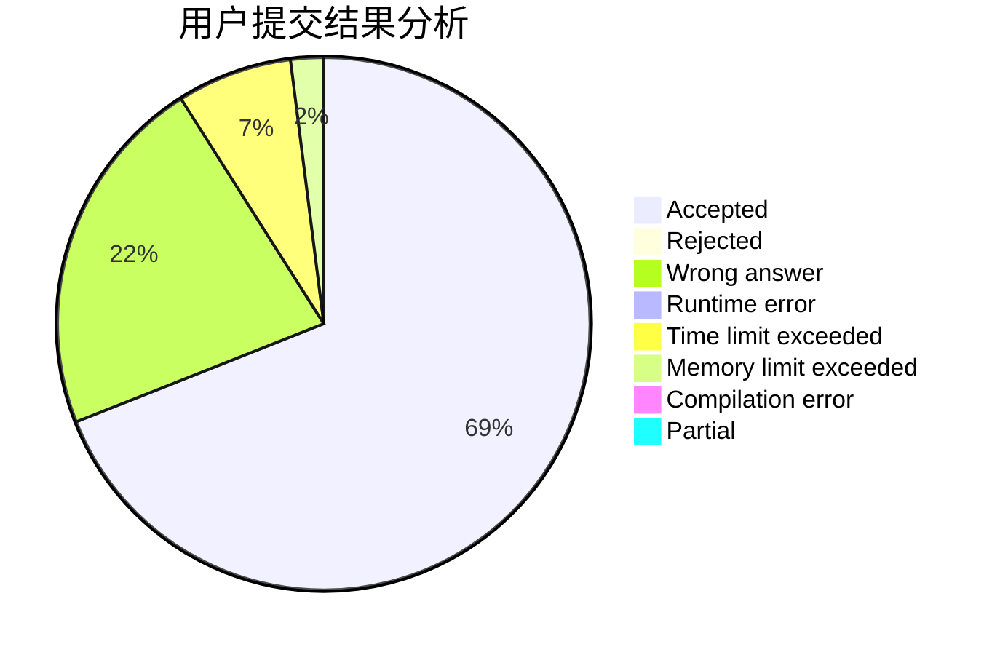
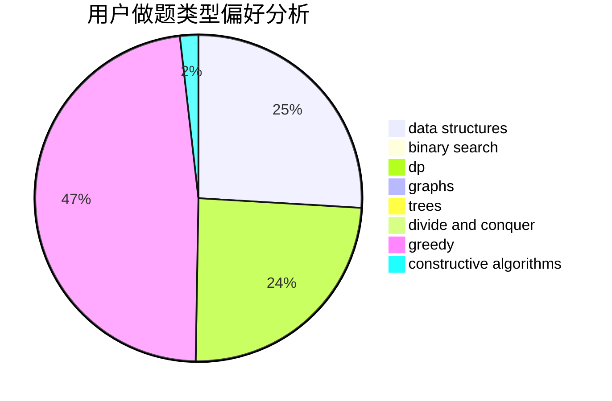

# forerunner

<!-- tabs:start -->

#### **用户提交结果分析**

#### **用户做题类型偏好分析**

#### **用户错题知识点分析**

<!-- tabs:end -->
# 推荐题目
[1335C](https://codeforces.com/contest/1335/problem/C)		binary search,
                        greedy,
                        implementation,
                        sortings		  
[1324A](https://codeforces.com/contest/1324/problem/A)		implementation,
                        number theory		  
[978E](https://codeforces.com/contest/978/problem/E)		combinatorics,
                        math		  
[254A](https://codeforces.com/contest/254/problem/A)		constructive algorithms,
                        sortings		  
[314C](https://codeforces.com/contest/314/problem/C)		data structures,
                        dp		  
[631E](https://codeforces.com/contest/631/problem/E)		data structures,
                        dp,
                        geometry		  
[1394C](https://codeforces.com/contest/1394/problem/C)		binary search,
                        geometry,
                        ternary search		  
[369A](https://codeforces.com/contest/369/problem/A)		greedy,
                        implementation		  
[1030D](https://codeforces.com/contest/1030/problem/D)		geometry,
                        number theory		  
[576A](https://codeforces.com/contest/576/problem/A)		math,
                        number theory		  
