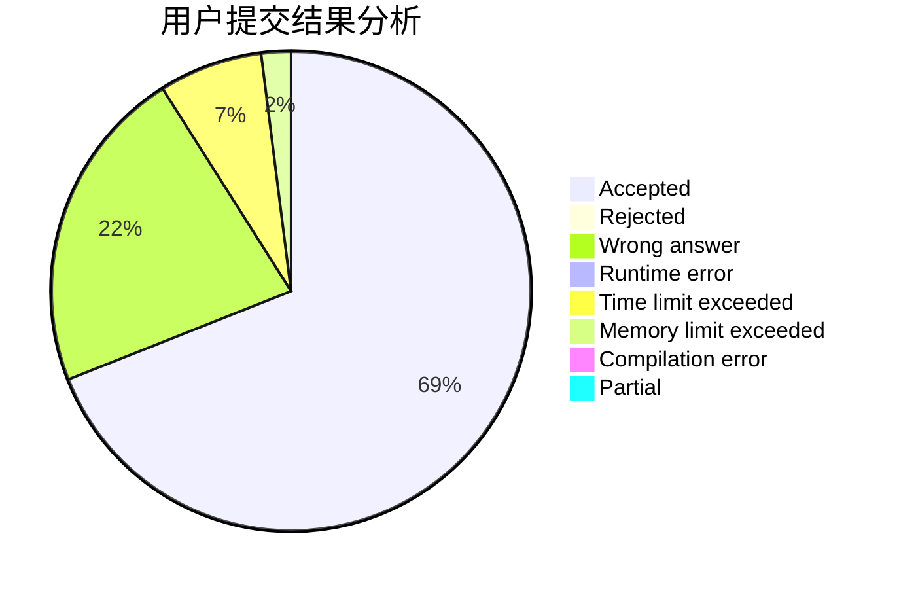
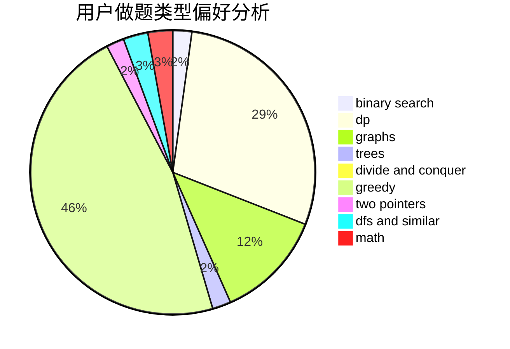

# forerunner

<!-- tabs:start -->

#### **用户提交结果分析**

#### **用户做题类型偏好分析**

<!-- tabs:end -->
# 推荐题目
[1335C](https://codeforces.com/contest/1335/problem/C)
[1324A](https://codeforces.com/contest/1324/problem/A)
[978E](https://codeforces.com/contest/978/problem/E)
[254A](https://codeforces.com/contest/254/problem/A)
[314C](https://codeforces.com/contest/314/problem/C)
[631E](https://codeforces.com/contest/631/problem/E)
[1394C](https://codeforces.com/contest/1394/problem/C)
[369A](https://codeforces.com/contest/369/problem/A)
[1030D](https://codeforces.com/contest/1030/problem/D)
[576A](https://codeforces.com/contest/576/problem/A)
