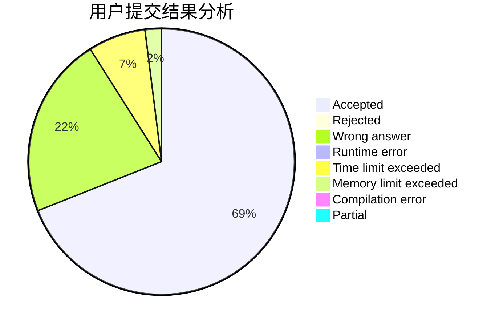
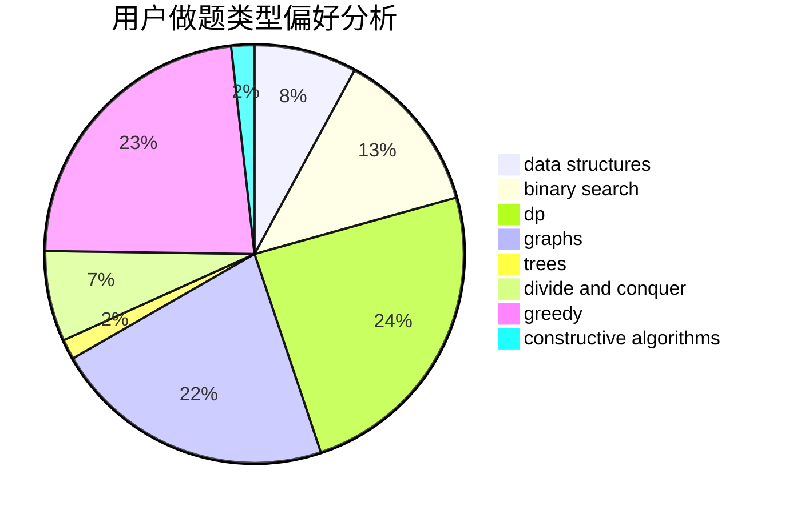

# forerunner

<!-- tabs:start -->

#### **用户提交结果分析**

#### **用户做题类型偏好分析**

#### **用户错题知识点分析**

<!-- tabs:end -->
# 推荐题目
[1329C](https://codeforces.com/contest/1329/problem/C)		constructive algorithms,
                        data structures,
                        greedy,
                        implementation		  
[1314B](https://codeforces.com/contest/1314/problem/B)		dsu,graphs,sortings,trees		  
[957B](https://codeforces.com/contest/957/problem/B)		dsu,graphs,sortings,trees		  
[232B](https://codeforces.com/contest/232/problem/B)		bitmasks,
                        combinatorics,
                        dp,
                        math		  
[297D](https://codeforces.com/contest/297/problem/D)		constructive algorithms		  
[612C](https://codeforces.com/contest/612/problem/C)		data structures,
                        expression parsing,
                        math		  
[1384C](https://codeforces.com/contest/1384/problem/C)		dsu,graphs,sortings,trees		  
[341D](https://codeforces.com/contest/341/problem/D)		data structures		  
[1030A](https://codeforces.com/contest/1030/problem/A)		implementation		  
[551A](https://codeforces.com/contest/551/problem/A)		brute force,
                        implementation,
                        sortings		  
