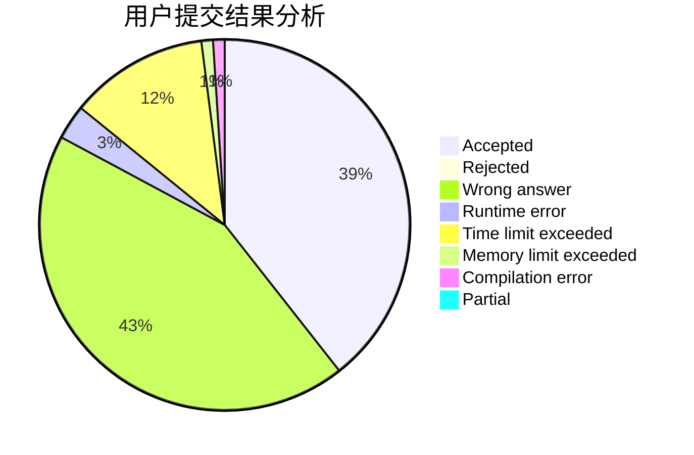
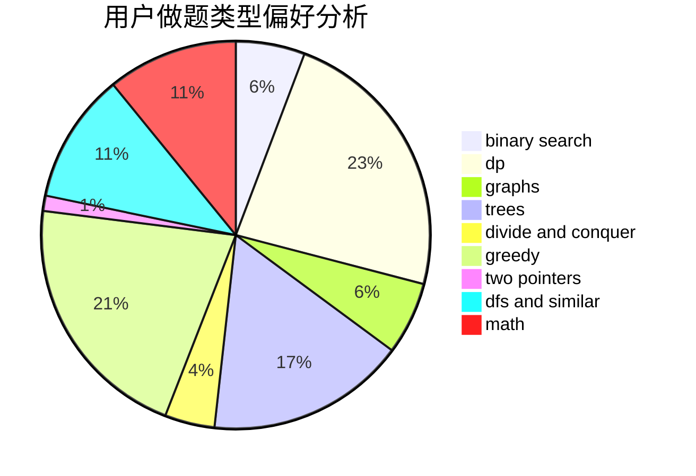

# forgotten

<!-- tabs:start -->

#### **用户提交结果分析**

#### **用户做题类型偏好分析**

<!-- tabs:end -->
# 推荐题目
[913B](https://codeforces.com/contest/913/problem/B)
[166E](https://codeforces.com/contest/166/problem/E)
[938D](https://codeforces.com/contest/938/problem/D)
[1075A](https://codeforces.com/contest/1075/problem/A)
[1151E](https://codeforces.com/contest/1151/problem/E)
[863A](https://codeforces.com/contest/863/problem/A)
[119A](https://codeforces.com/contest/119/problem/A)
[1020D](https://codeforces.com/contest/1020/problem/D)
[571C](https://codeforces.com/contest/571/problem/C)
[183D](https://codeforces.com/contest/183/problem/D)
