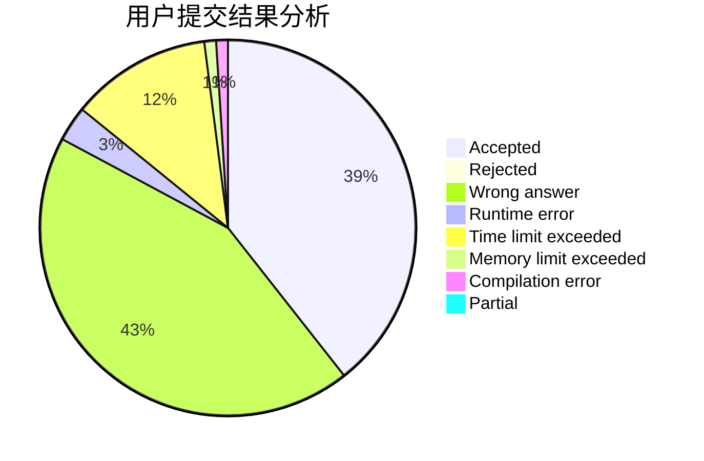
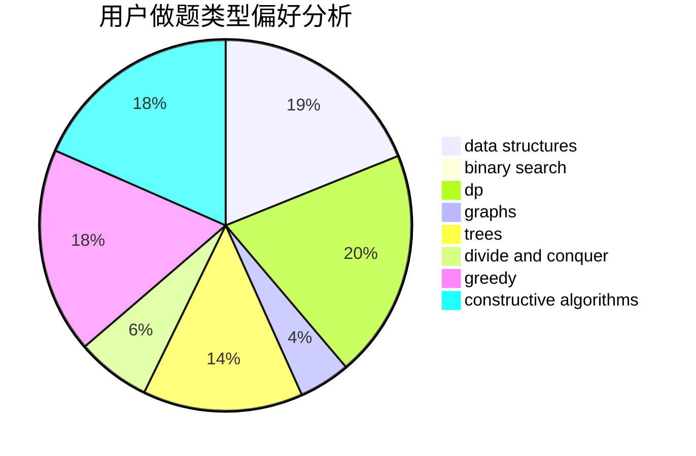

# forgotten

<!-- tabs:start -->

#### **用户提交结果分析**

#### **用户做题类型偏好分析**

#### **用户错题知识点分析**

<!-- tabs:end -->
# 推荐题目
[913B](https://codeforces.com/contest/913/problem/B)		implementation,
                        trees		  
[166E](https://codeforces.com/contest/166/problem/E)		dp,
                        math,
                        matrices		  
[938D](https://codeforces.com/contest/938/problem/D)		data structures,
                        graphs,
                        shortest paths		  
[1075A](https://codeforces.com/contest/1075/problem/A)		implementation,
                        math		  
[1151E](https://codeforces.com/contest/1151/problem/E)		combinatorics,
                        data structures,
                        dp,
                        math		  
[863A](https://codeforces.com/contest/863/problem/A)		brute force,
                        implementation		  
[119A](https://codeforces.com/contest/119/problem/A)		implementation		  
[1020D](https://codeforces.com/contest/1020/problem/D)		dsu,graphs,sortings,trees		  
[571C](https://codeforces.com/contest/571/problem/C)		constructive algorithms,
                        dfs and similar,
                        graphs,
                        greedy		  
[183D](https://codeforces.com/contest/183/problem/D)		dp,
                        greedy,
                        probabilities		  
