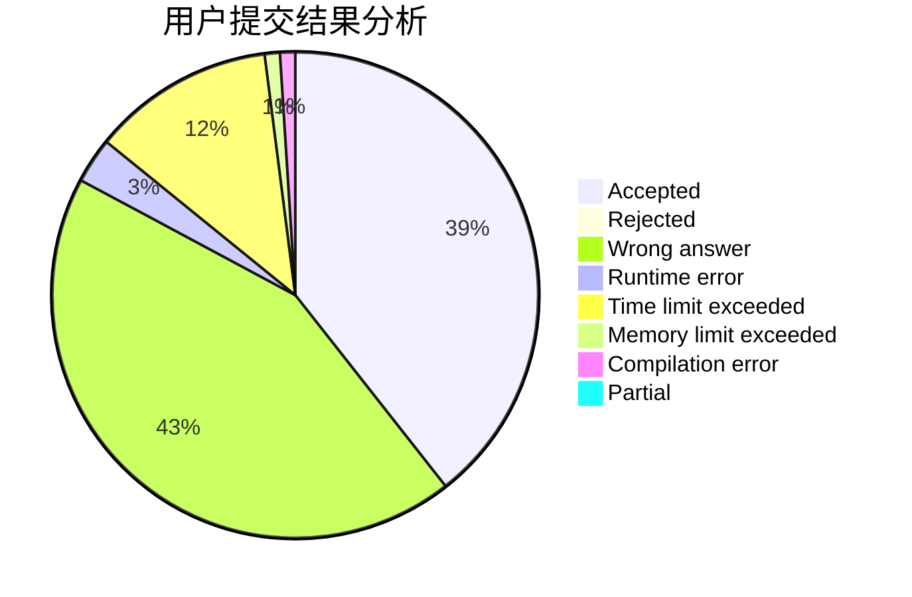
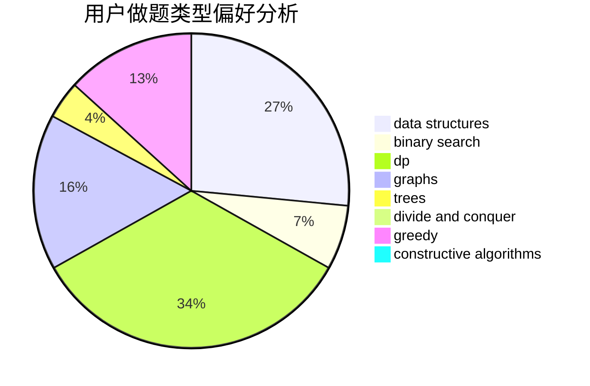

# forgotten

<!-- tabs:start -->

#### **用户提交结果分析**

#### **用户做题类型偏好分析**

#### **用户错题知识点分析**

<!-- tabs:end -->
# 推荐题目
[895D](https://codeforces.com/contest/895/problem/D)		combinatorics,
                        math,
                        strings		  
[1510K](https://codeforces.com/contest/1510/problem/K)		brute force,
                        graphs,
                        implementation		  
[918A](https://codeforces.com/contest/918/problem/A)		brute force,
                        implementation		  
[1074A](https://codeforces.com/contest/1074/problem/A)		dsu,graphs,sortings,trees		  
[114B](https://codeforces.com/contest/114/problem/B)		bitmasks,
                        brute force,
                        graphs		  
[844A](https://codeforces.com/contest/844/problem/A)		greedy,
                        implementation,
                        strings		  
[1195D2](https://codeforces.com/contest/1195D/problem/2)		combinatorics,
                        math,
                        number theory		  
[1020A](https://codeforces.com/contest/1020/problem/A)		math		  
[547A](https://codeforces.com/contest/547/problem/A)		brute force,
                        greedy,
                        implementation,
                        math		  
[160A](https://codeforces.com/contest/160/problem/A)		greedy,
                        sortings		  
