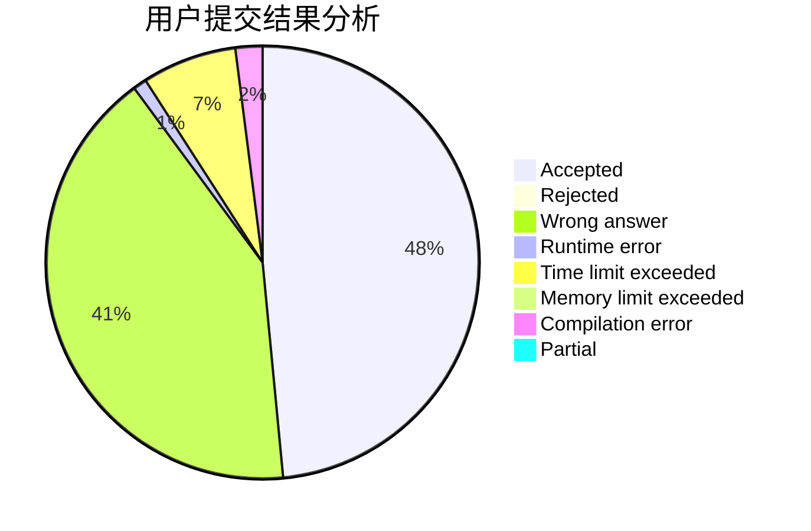
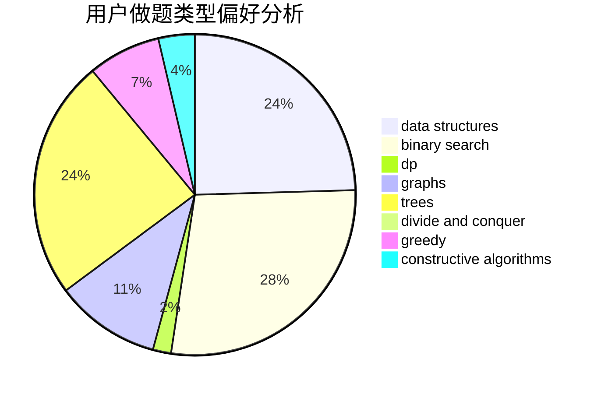
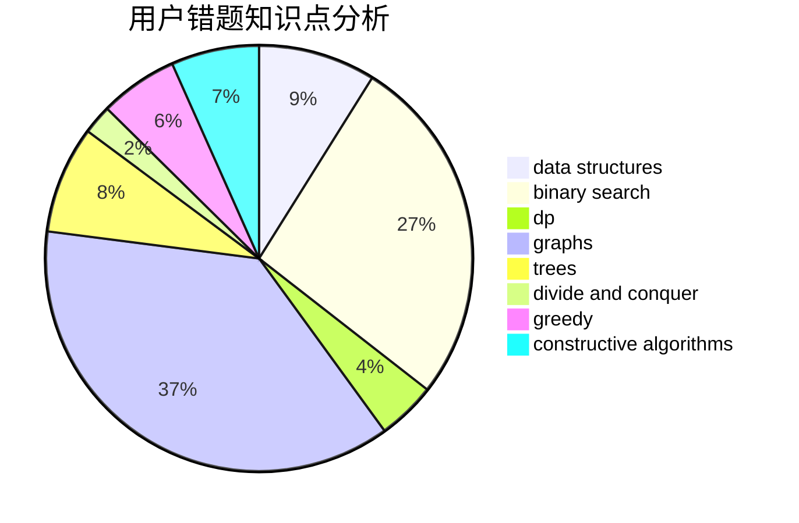

# forlight

<!-- tabs:start -->

#### **用户提交结果分析**

#### **用户做题类型偏好分析**

#### **用户错题知识点分析**

<!-- tabs:end -->
# 推荐题目
[225E](https://codeforces.com/contest/225/problem/E)		math,
                        number theory		  
[317A](https://codeforces.com/contest/317/problem/A)		brute force		  
[1020A](https://codeforces.com/contest/1020/problem/A)		math		  
[892A](https://codeforces.com/contest/892/problem/A)		greedy,
                        implementation		  
[779E](https://codeforces.com/contest/779/problem/E)		dsu,graphs,sortings,trees		  
[178F1](https://codeforces.com/contest/178F/problem/1)		nan		  
[767C](https://codeforces.com/contest/767/problem/C)		dfs and similar,
                        graphs,
                        greedy,
                        trees		  
[883B](https://codeforces.com/contest/883/problem/B)		constructive algorithms,
                        graphs,
                        greedy		  
[479C](https://codeforces.com/contest/479/problem/C)		greedy,
                        sortings		  
[1141A](https://codeforces.com/contest/1141/problem/A)		implementation,
                        math		  
