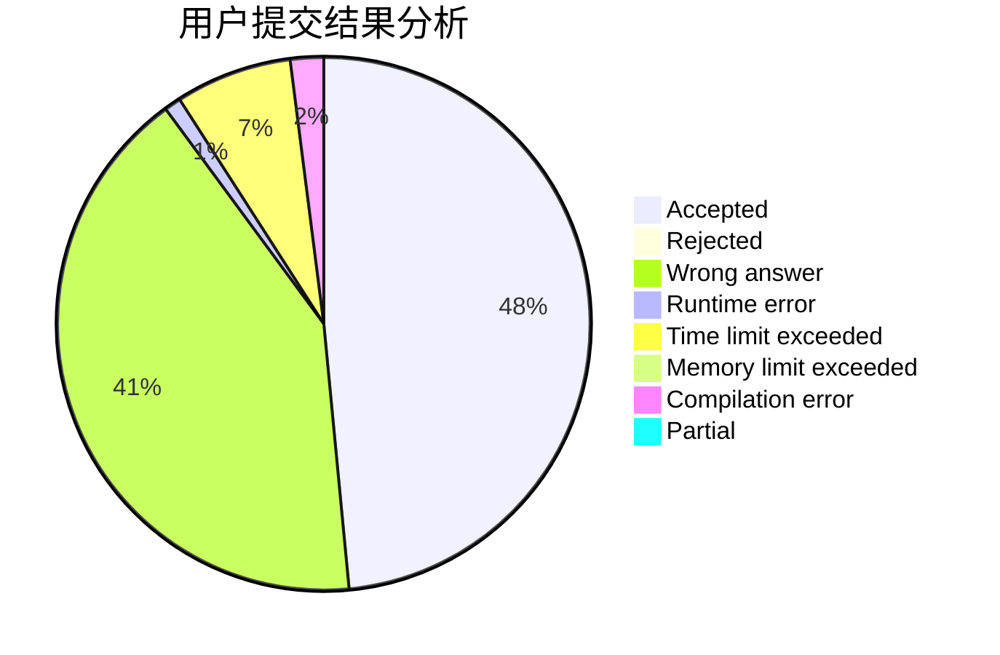
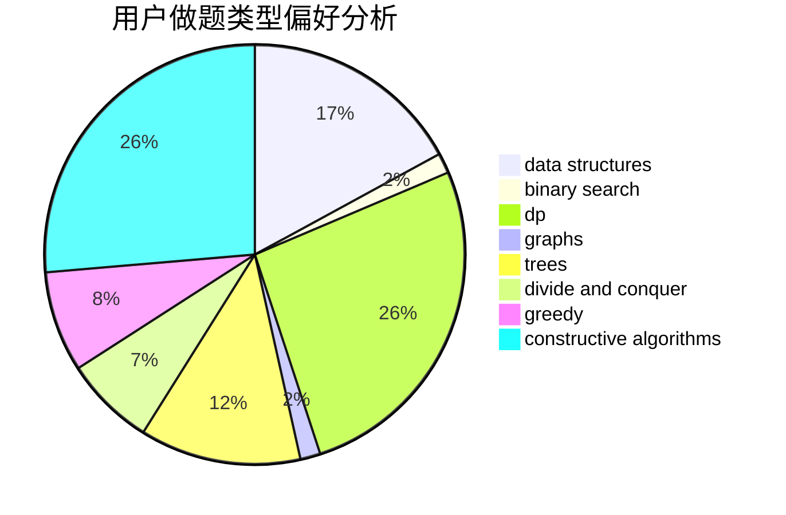
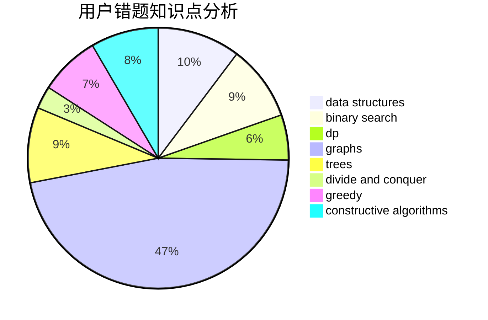

# forlight

<!-- tabs:start -->

#### **用户提交结果分析**

#### **用户做题类型偏好分析**

#### **用户错题知识点分析**

<!-- tabs:end -->
# 推荐题目
[244C](https://codeforces.com/contest/244/problem/C)		dsu,graphs,sortings,trees		  
[346B](https://codeforces.com/contest/346/problem/B)		dp,
                        strings		  
[1020D](https://codeforces.com/contest/1020/problem/D)		dsu,graphs,sortings,trees		  
[910B](https://codeforces.com/contest/910/problem/B)		greedy,
                        implementation		  
[798A](https://codeforces.com/contest/798/problem/A)		brute force,
                        constructive algorithms,
                        strings		  
[204D](https://codeforces.com/contest/204/problem/D)		dp		  
[786E](https://codeforces.com/contest/786/problem/E)		data structures,
                        flows,
                        graphs,
                        trees		  
[900A](https://codeforces.com/contest/900/problem/A)		geometry,
                        implementation		  
[49E](https://codeforces.com/contest/49/problem/E)		dp		  
[1143A](https://codeforces.com/contest/1143/problem/A)		implementation		  
