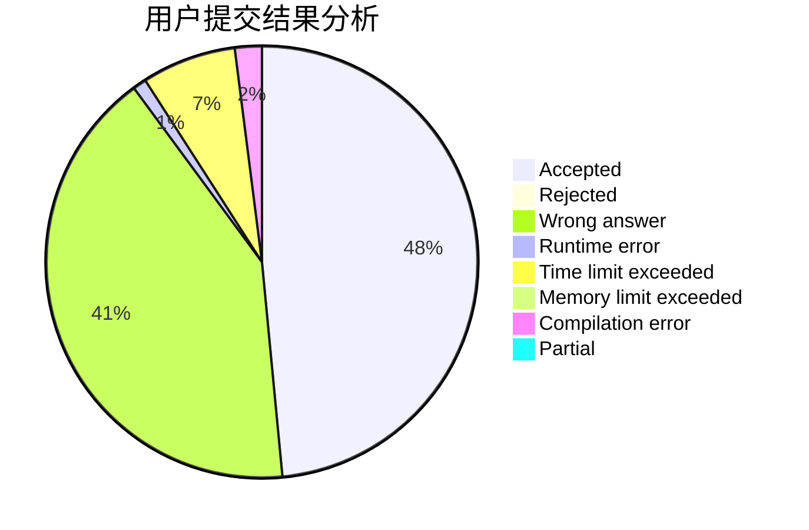
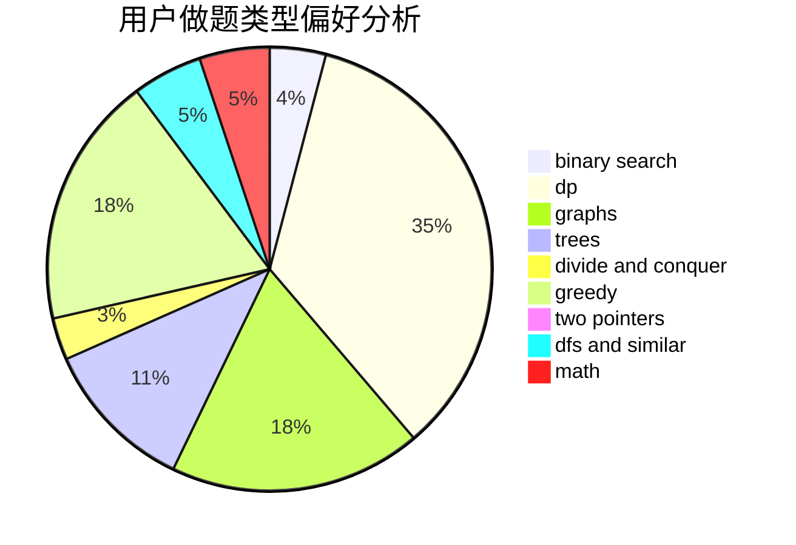

# forlight

<!-- tabs:start -->

#### **用户提交结果分析**

#### **用户做题类型偏好分析**

<!-- tabs:end -->
# 推荐题目
[244C](https://codeforces.com/contest/244/problem/C)
[346B](https://codeforces.com/contest/346/problem/B)
[1020D](https://codeforces.com/contest/1020/problem/D)
[910B](https://codeforces.com/contest/910/problem/B)
[798A](https://codeforces.com/contest/798/problem/A)
[204D](https://codeforces.com/contest/204/problem/D)
[786E](https://codeforces.com/contest/786/problem/E)
[900A](https://codeforces.com/contest/900/problem/A)
[49E](https://codeforces.com/contest/49/problem/E)
[1143A](https://codeforces.com/contest/1143/problem/A)
