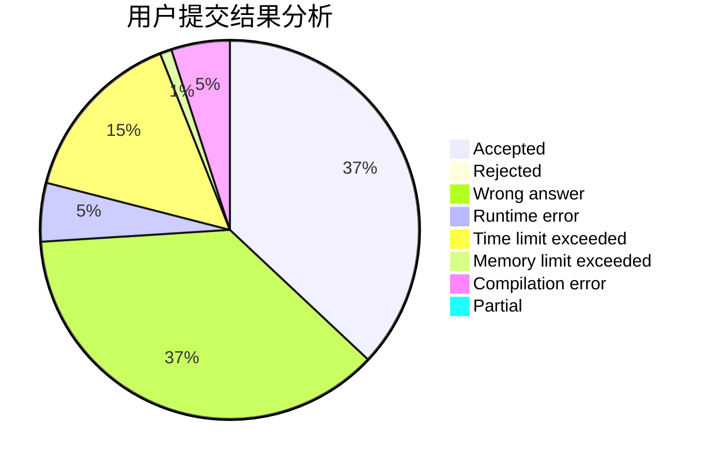
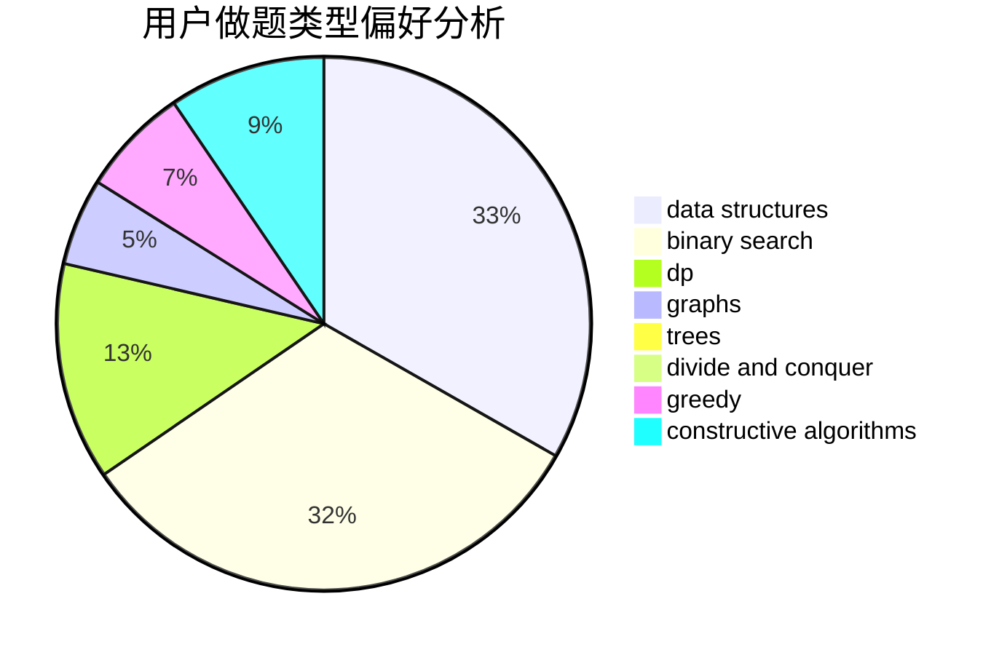

# frame233

<!-- tabs:start -->

#### **用户提交结果分析**

#### **用户做题类型偏好分析**

#### **用户错题知识点分析**

<!-- tabs:end -->
# 推荐题目
[1291E](https://codeforces.com/contest/1291/problem/E)		dsu,graphs,sortings,trees		  
[439D](https://codeforces.com/contest/439/problem/D)		binary search,
                        sortings,
                        ternary search,
                        two pointers		  
[837B](https://codeforces.com/contest/837/problem/B)		brute force,
                        implementation		  
[785A](https://codeforces.com/contest/785/problem/A)		implementation,
                        strings		  
[1148E](https://codeforces.com/contest/1148/problem/E)		constructive algorithms,
                        greedy,
                        math,
                        sortings,
                        two pointers		  
[865A](https://codeforces.com/contest/865/problem/A)		constructive algorithms		  
[1079D](https://codeforces.com/contest/1079/problem/D)		dsu,graphs,sortings,trees		  
[290B](https://codeforces.com/contest/290/problem/B)		*special problem,
                        implementation		  
[140B](https://codeforces.com/contest/140/problem/B)		brute force,
                        greedy,
                        implementation		  
[1334B](https://codeforces.com/contest/1334/problem/B)		greedy,
                        sortings		  
