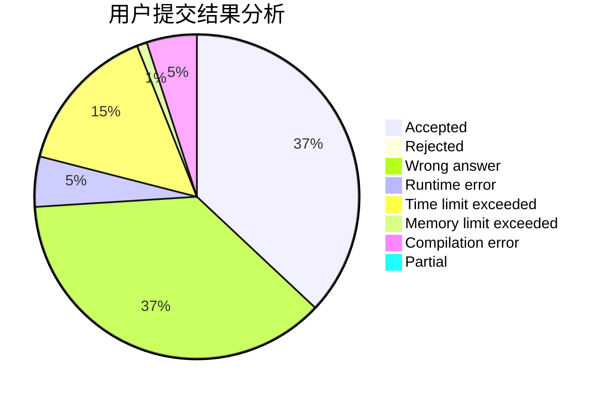
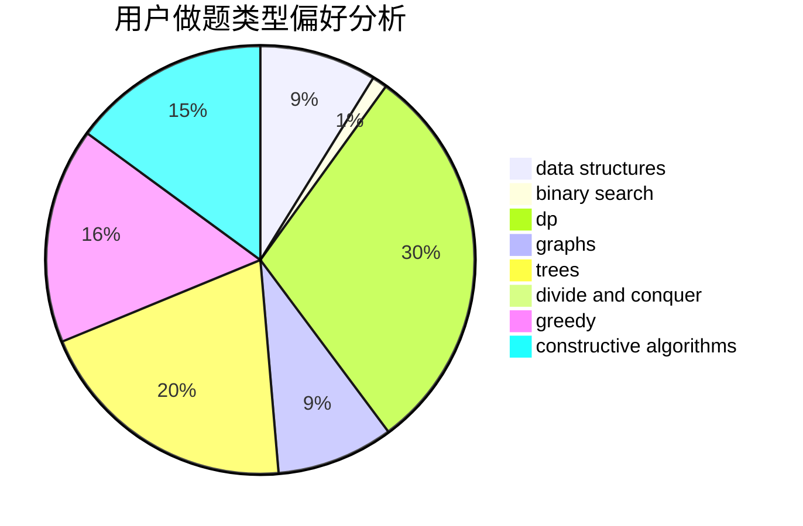

# frame233

<!-- tabs:start -->

#### **用户提交结果分析**

#### **用户做题类型偏好分析**

#### **用户错题知识点分析**

<!-- tabs:end -->
# 推荐题目
[1298D](https://codeforces.com/contest/1298/problem/D)		dsu,graphs,sortings,trees		  
[460E](https://codeforces.com/contest/460/problem/E)		brute force,
                        geometry,
                        math,
                        sortings		  
[854B](https://codeforces.com/contest/854/problem/B)		constructive algorithms,
                        math		  
[802D](https://codeforces.com/contest/802/problem/D)		math		  
[114E](https://codeforces.com/contest/114/problem/E)		dsu,graphs,sortings,trees		  
[884D](https://codeforces.com/contest/884/problem/D)		data structures,
                        greedy		  
[107C](https://codeforces.com/contest/107/problem/C)		bitmasks,
                        dp		  
[305B](https://codeforces.com/contest/305/problem/B)		brute force,
                        implementation,
                        math		  
[1420D](https://codeforces.com/contest/1420/problem/D)		combinatorics,
                        data structures,
                        sortings		  
[1341A](https://codeforces.com/contest/1341/problem/A)		math		  
