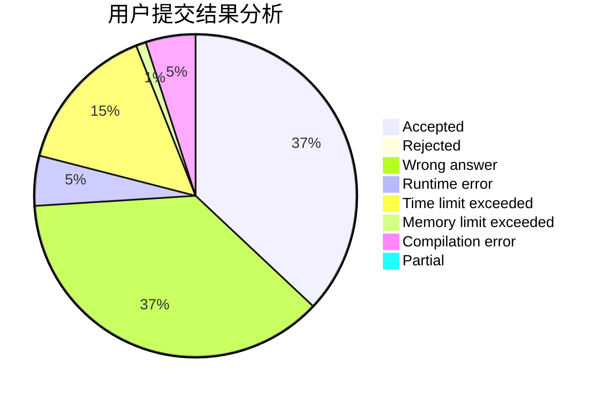
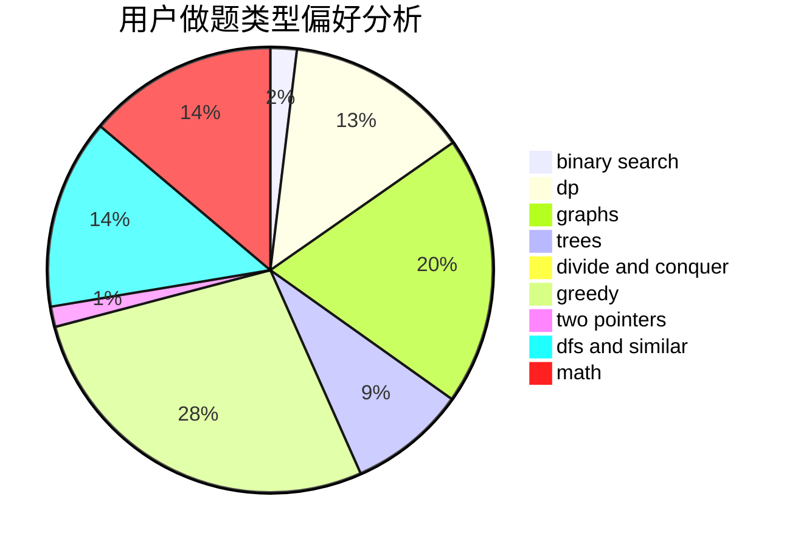

# frame233

<!-- tabs:start -->

#### **用户提交结果分析**

#### **用户做题类型偏好分析**

<!-- tabs:end -->
# 推荐题目
[1298D](https://codeforces.com/contest/1298/problem/D)
[460E](https://codeforces.com/contest/460/problem/E)
[854B](https://codeforces.com/contest/854/problem/B)
[802D](https://codeforces.com/contest/802/problem/D)
[114E](https://codeforces.com/contest/114/problem/E)
[884D](https://codeforces.com/contest/884/problem/D)
[107C](https://codeforces.com/contest/107/problem/C)
[305B](https://codeforces.com/contest/305/problem/B)
[1420D](https://codeforces.com/contest/1420/problem/D)
[1341A](https://codeforces.com/contest/1341/problem/A)
