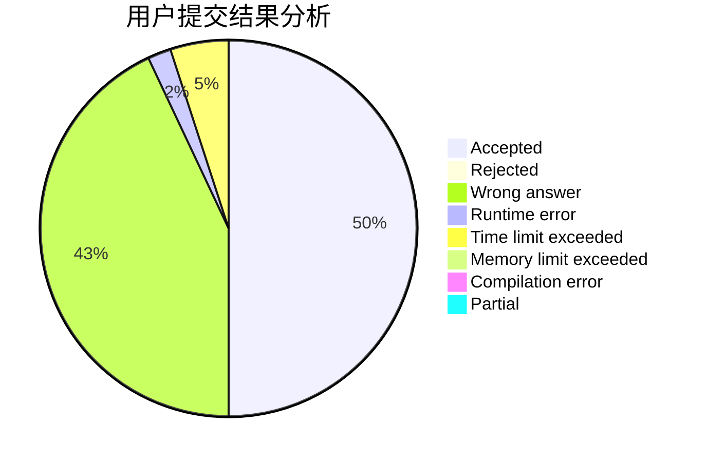
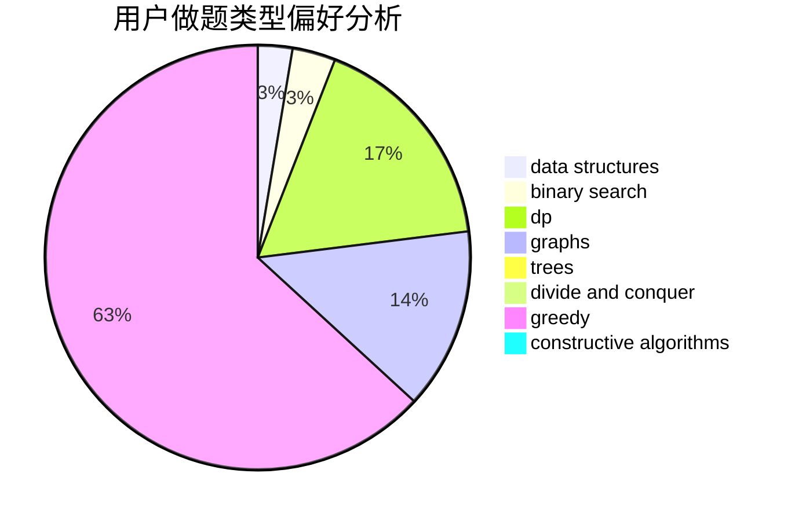
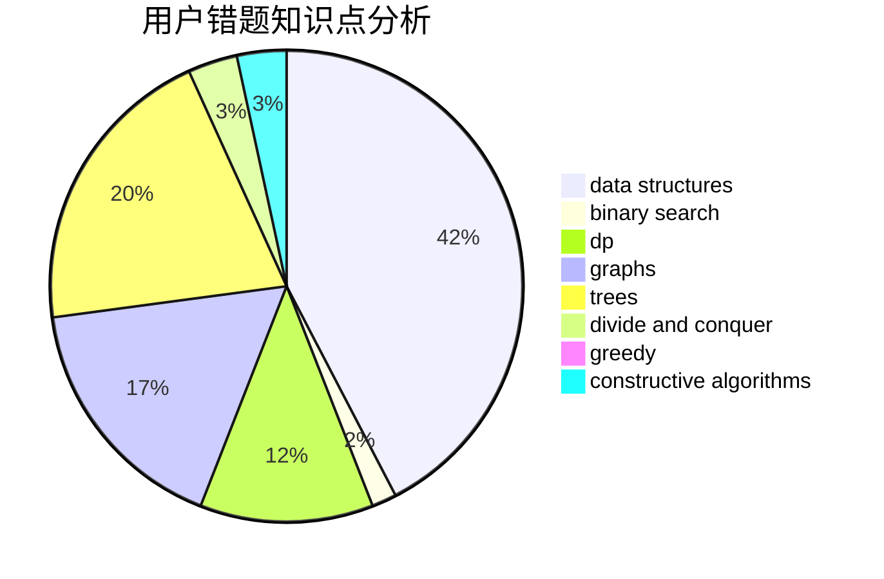

# fried-chicken

<!-- tabs:start -->

#### **用户提交结果分析**

#### **用户做题类型偏好分析**

#### **用户错题知识点分析**

<!-- tabs:end -->
# 推荐题目
[1150A](https://codeforces.com/contest/1150/problem/A)		greedy,
                        implementation		  
[1207C](https://codeforces.com/contest/1207/problem/C)		dp,
                        greedy		  
[196E](https://codeforces.com/contest/196/problem/E)		dsu,
                        graphs,
                        shortest paths		  
[316A1](https://codeforces.com/contest/316A/problem/1)		greedy		  
[1214E](https://codeforces.com/contest/1214/problem/E)		constructive algorithms,
                        graphs,
                        math,
                        sortings,
                        trees		  
[574D](https://codeforces.com/contest/574/problem/D)		dsu,graphs,sortings,trees		  
[725F](https://codeforces.com/contest/725/problem/F)		games,
                        greedy		  
[1250M](https://codeforces.com/contest/1250/problem/M)		constructive algorithms,
                        divide and conquer		  
[441E](https://codeforces.com/contest/441/problem/E)		bitmasks,
                        dp,
                        math,
                        probabilities		  
[1067B](https://codeforces.com/contest/1067/problem/B)		dfs and similar,
                        graphs,
                        shortest paths		  
