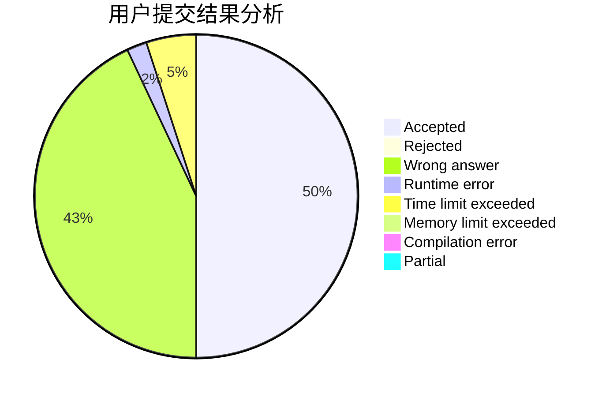
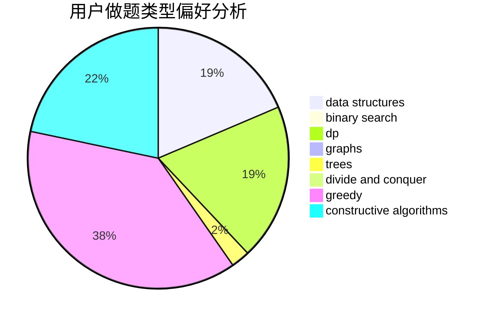

# fried-chicken

<!-- tabs:start -->

#### **用户提交结果分析**

#### **用户做题类型偏好分析**

#### **用户错题知识点分析**

<!-- tabs:end -->
# 推荐题目
[1152A](https://codeforces.com/contest/1152/problem/A)		greedy,
                        implementation,
                        math		  
[12131](https://codeforces.com/contest/1213/problem/1)		dsu,graphs,sortings,trees		  
[218D](https://codeforces.com/contest/218/problem/D)		dsu,graphs,sortings,trees		  
[339E](https://codeforces.com/contest/339/problem/E)		constructive algorithms,
                        dfs and similar,
                        greedy		  
[1220A](https://codeforces.com/contest/1220/problem/A)		implementation,
                        sortings,
                        strings		  
[594E](https://codeforces.com/contest/594/problem/E)		string suffix structures,
                        strings		  
[744A](https://codeforces.com/contest/744/problem/A)		dfs and similar,
                        graphs		  
[1255D](https://codeforces.com/contest/1255/problem/D)		dsu,graphs,sortings,trees		  
[462C](https://codeforces.com/contest/462/problem/C)		dsu,graphs,sortings,trees		  
[1067E](https://codeforces.com/contest/1067/problem/E)		dp,
                        graph matchings,
                        math,
                        trees		  
