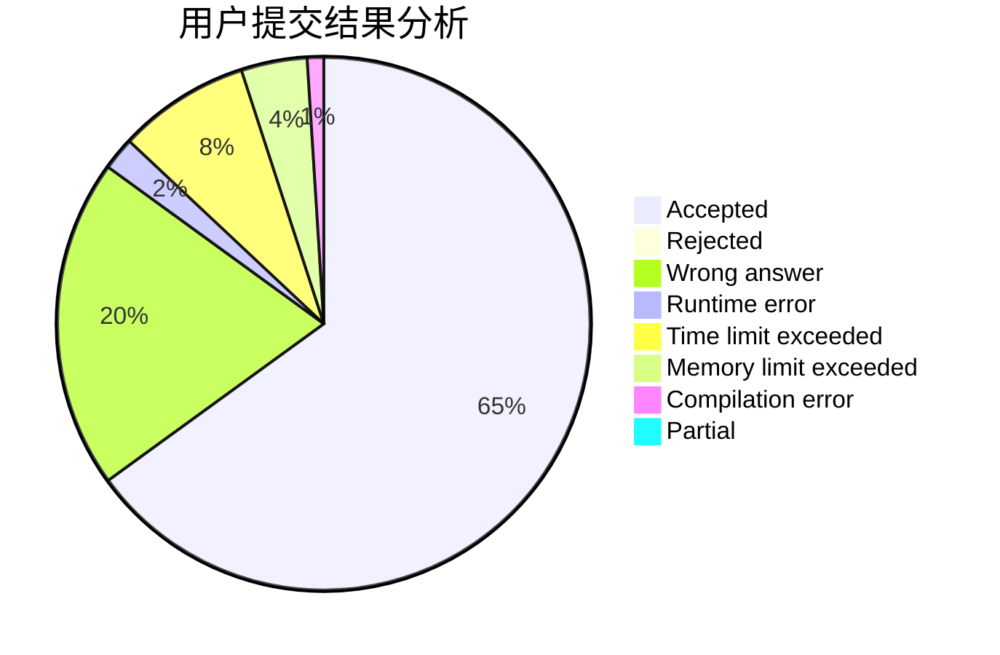
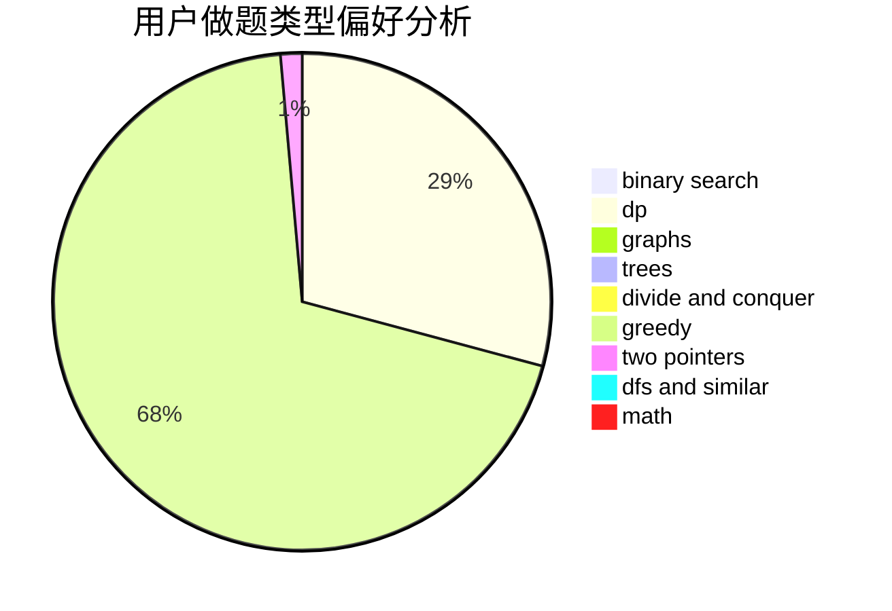

# froggyzhang

<!-- tabs:start -->

#### **用户提交结果分析**

#### **用户做题类型偏好分析**

<!-- tabs:end -->
# 推荐题目
[311A](https://codeforces.com/contest/311/problem/A)
[710D](https://codeforces.com/contest/710/problem/D)
[1023A](https://codeforces.com/contest/1023/problem/A)
[576A](https://codeforces.com/contest/576/problem/A)
[459C](https://codeforces.com/contest/459/problem/C)
[1267A](https://codeforces.com/contest/1267/problem/A)
[213E](https://codeforces.com/contest/213/problem/E)
[1297B](https://codeforces.com/contest/1297/problem/B)
[985C](https://codeforces.com/contest/985/problem/C)
[1492B](https://codeforces.com/contest/1492/problem/B)
