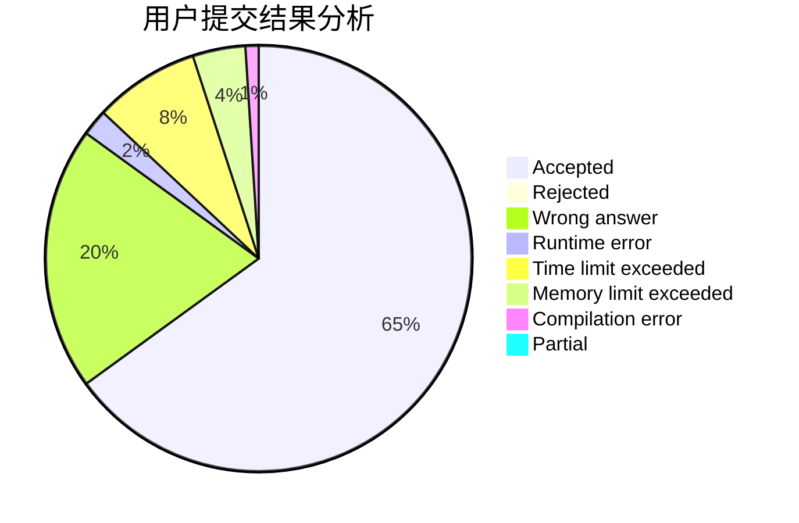
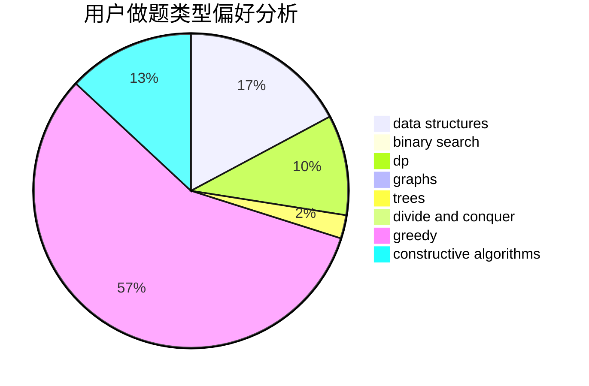

# froggyzhang

<!-- tabs:start -->

#### **用户提交结果分析**

#### **用户做题类型偏好分析**

#### **用户错题知识点分析**

<!-- tabs:end -->
# 推荐题目
[311A](https://codeforces.com/contest/311/problem/A)		constructive algorithms,
                        implementation		  
[710D](https://codeforces.com/contest/710/problem/D)		math,
                        number theory		  
[1023A](https://codeforces.com/contest/1023/problem/A)		brute force,
                        implementation,
                        strings		  
[576A](https://codeforces.com/contest/576/problem/A)		math,
                        number theory		  
[459C](https://codeforces.com/contest/459/problem/C)		combinatorics,
                        constructive algorithms,
                        math		  
[1267A](https://codeforces.com/contest/1267/problem/A)		nan		  
[213E](https://codeforces.com/contest/213/problem/E)		data structures,
                        hashing,
                        strings		  
[1297B](https://codeforces.com/contest/1297/problem/B)		*special problem,
                        implementation,
                        sortings		  
[985C](https://codeforces.com/contest/985/problem/C)		greedy		  
[1492B](https://codeforces.com/contest/1492/problem/B)		data structures,
                        greedy,
                        math		  
