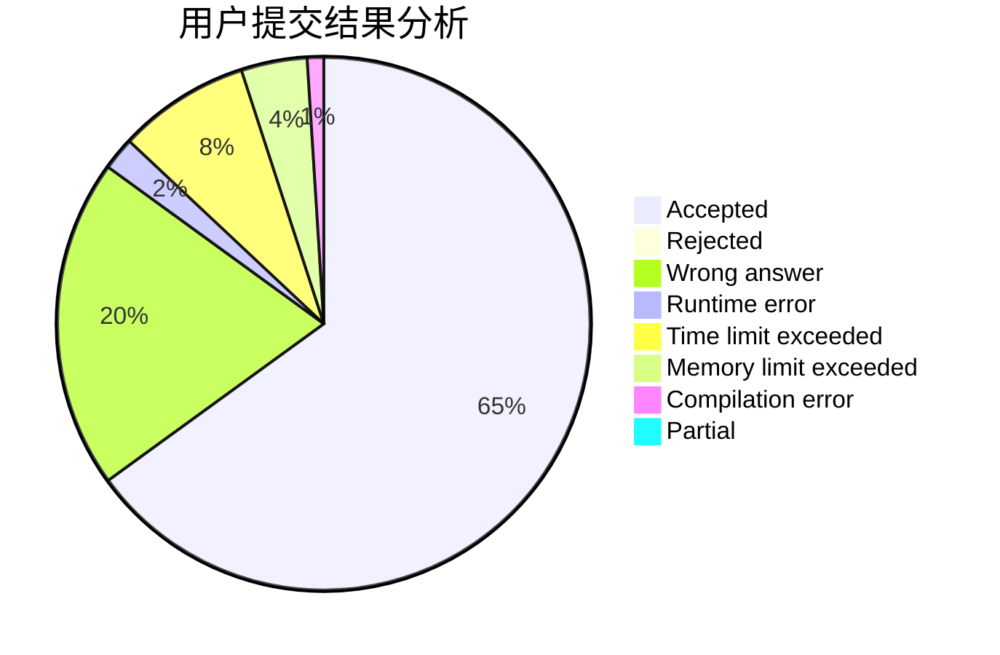
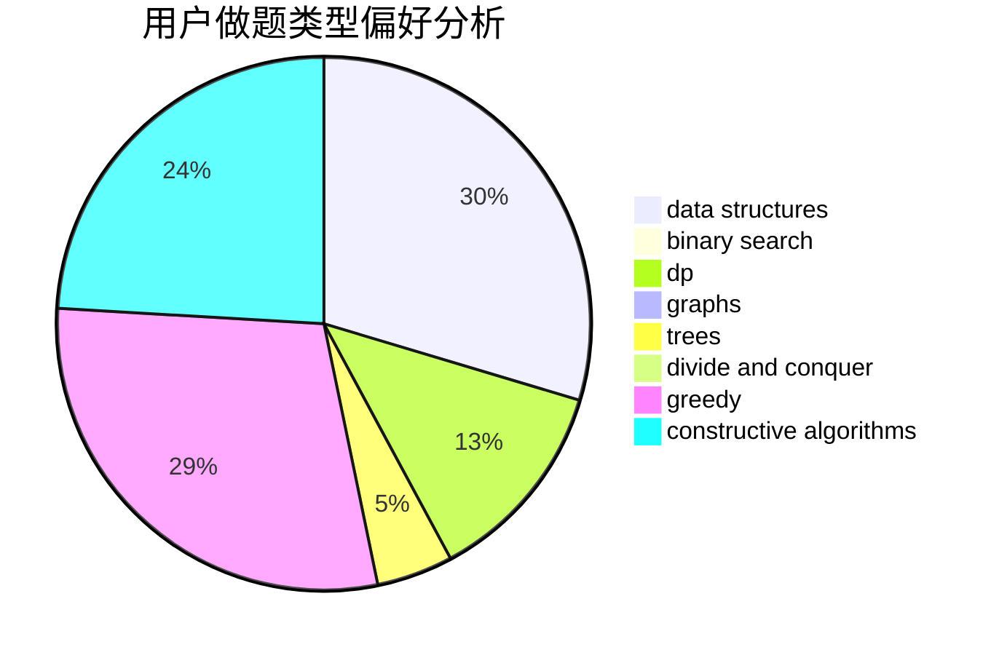
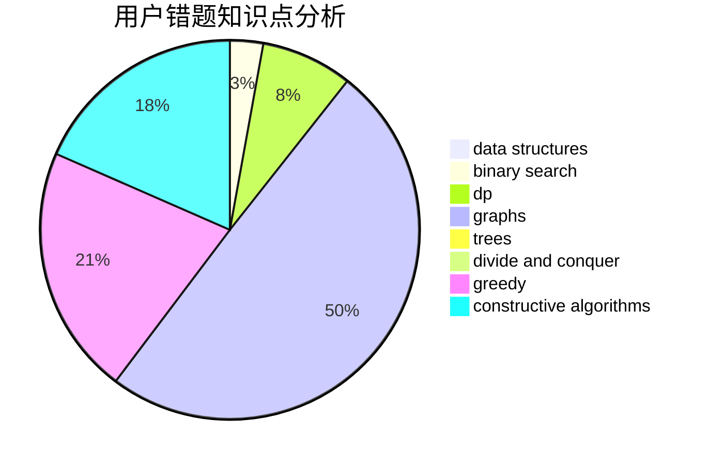

# froggyzhang

<!-- tabs:start -->

#### **用户提交结果分析**

#### **用户做题类型偏好分析**

#### **用户错题知识点分析**

<!-- tabs:end -->
# 推荐题目
[294D](https://codeforces.com/contest/294/problem/D)		brute force,
                        implementation,
                        number theory		  
[690D1](https://codeforces.com/contest/690D/problem/1)		nan		  
[1020C](https://codeforces.com/contest/1020/problem/C)		dsu,graphs,sortings,trees		  
[551A](https://codeforces.com/contest/551/problem/A)		brute force,
                        implementation,
                        sortings		  
[437A](https://codeforces.com/contest/437/problem/A)		implementation		  
[1261B2](https://codeforces.com/contest/1261B/problem/2)		dsu,graphs,sortings,trees		  
[189E](https://codeforces.com/contest/189/problem/E)		dsu,graphs,sortings,trees		  
[1290E](https://codeforces.com/contest/1290/problem/E)		data structures		  
[962D](https://codeforces.com/contest/962/problem/D)		data structures,
                        implementation		  
[1485A](https://codeforces.com/contest/1485/problem/A)		brute force,
                        greedy,
                        math,
                        number theory		  
