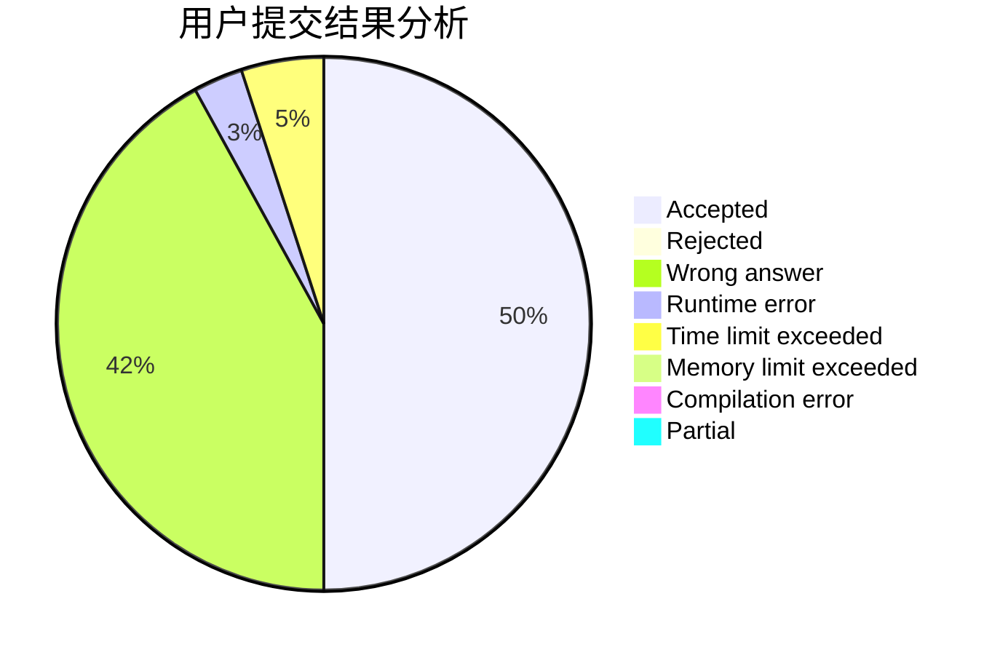
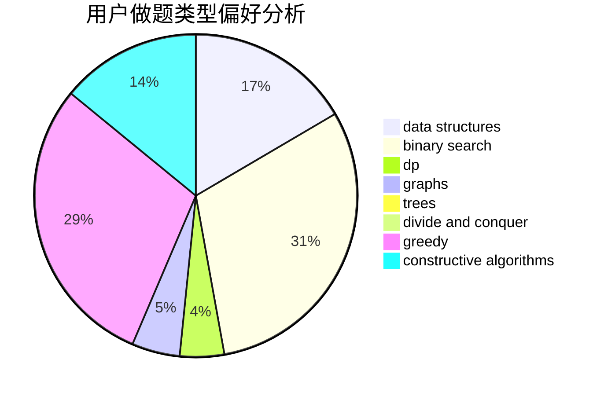

# fujang01

<!-- tabs:start -->

#### **用户提交结果分析**

#### **用户做题类型偏好分析**

#### **用户错题知识点分析**

<!-- tabs:end -->
# 推荐题目
[966B](https://codeforces.com/contest/966/problem/B)		dsu,graphs,sortings,trees		  
[1370A](https://codeforces.com/contest/1370/problem/A)		greedy,
                        implementation,
                        math,
                        number theory		  
[424B](https://codeforces.com/contest/424/problem/B)		binary search,
                        greedy,
                        implementation,
                        sortings		  
[621E](https://codeforces.com/contest/621/problem/E)		dp,
                        matrices		  
[859F](https://codeforces.com/contest/859/problem/F)		greedy		  
[316G1](https://codeforces.com/contest/316G/problem/1)		hashing,
                        strings		  
[1243C](https://codeforces.com/contest/1243/problem/C)		dsu,graphs,sortings,trees		  
[1109A](https://codeforces.com/contest/1109/problem/A)		dp,
                        implementation		  
[834C](https://codeforces.com/contest/834/problem/C)		dsu,graphs,sortings,trees		  
[1157C1](https://codeforces.com/contest/1157C/problem/1)		greedy		  
