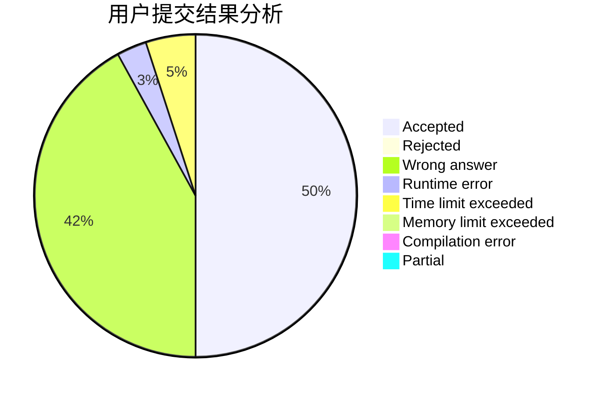
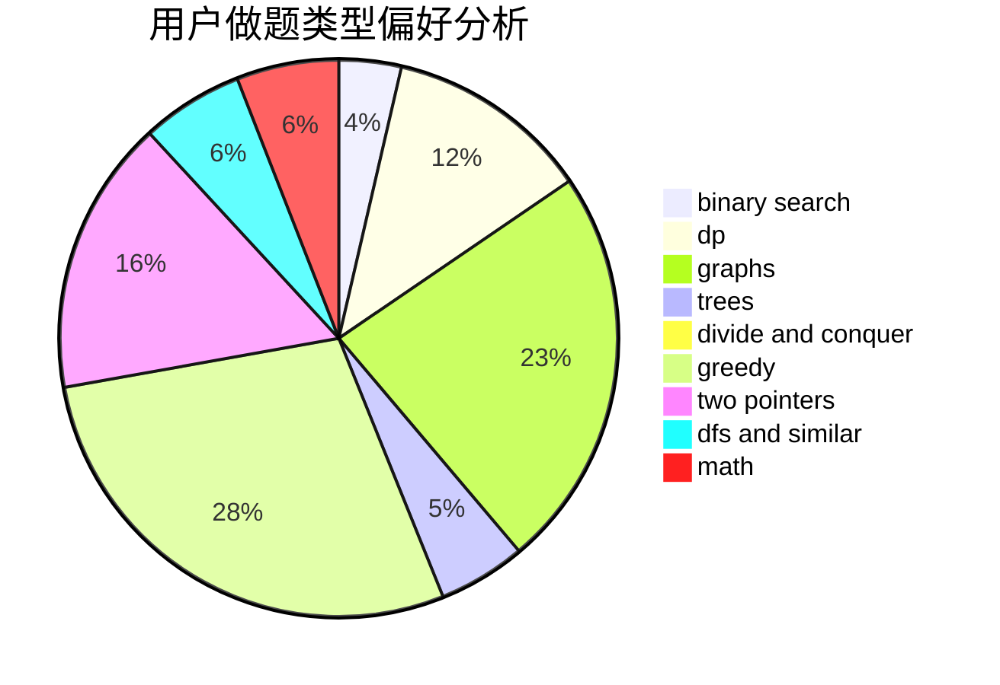

# fujang01

<!-- tabs:start -->

#### **用户提交结果分析**

#### **用户做题类型偏好分析**

<!-- tabs:end -->
# 推荐题目
[988A](https://codeforces.com/contest/988/problem/A)
[13783](https://codeforces.com/contest/1378/problem/3)
[447A](https://codeforces.com/contest/447/problem/A)
[645G](https://codeforces.com/contest/645/problem/G)
[877C](https://codeforces.com/contest/877/problem/C)
[344A](https://codeforces.com/contest/344/problem/A)
[1248C](https://codeforces.com/contest/1248/problem/C)
[1109E](https://codeforces.com/contest/1109/problem/E)
[852D](https://codeforces.com/contest/852/problem/D)
[1159C](https://codeforces.com/contest/1159/problem/C)
