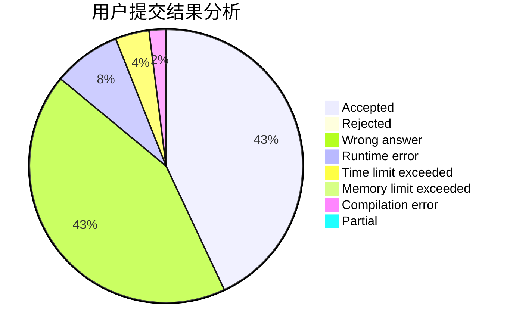
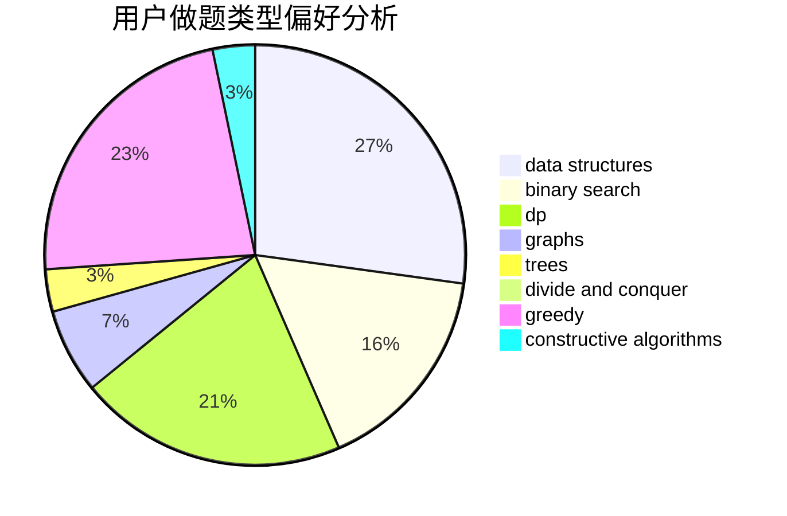

# funer

<!-- tabs:start -->

#### **用户提交结果分析**

#### **用户做题类型偏好分析**

#### **用户错题知识点分析**

<!-- tabs:end -->
# 推荐题目
[838E](https://codeforces.com/contest/838/problem/E)		dp		  
[925F](https://codeforces.com/contest/925/problem/F)		binary search,
                        flows		  
[1220A](https://codeforces.com/contest/1220/problem/A)		implementation,
                        sortings,
                        strings		  
[1354E](https://codeforces.com/contest/1354/problem/E)		dfs and similar,
                        dp,
                        graphs		  
[1030C](https://codeforces.com/contest/1030/problem/C)		implementation		  
[1149E](https://codeforces.com/contest/1149/problem/E)		games,
                        graphs		  
[660A](https://codeforces.com/contest/660/problem/A)		greedy,
                        implementation,
                        math,
                        number theory		  
[241B](https://codeforces.com/contest/241/problem/B)		binary search,
                        bitmasks,
                        data structures,
                        math		  
[762B](https://codeforces.com/contest/762/problem/B)		greedy,
                        implementation,
                        sortings,
                        two pointers		  
[1091F](https://codeforces.com/contest/1091/problem/F)		constructive algorithms,
                        greedy		  
