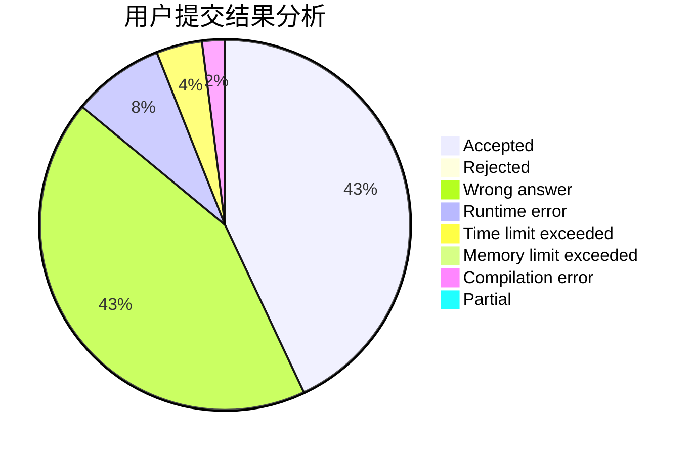
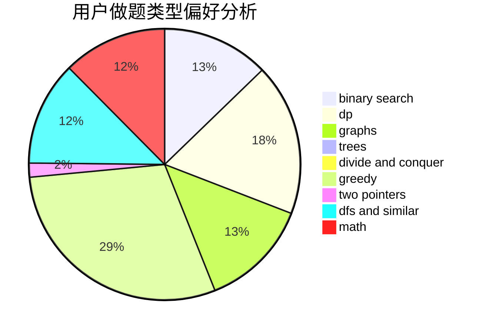

# funer

<!-- tabs:start -->

#### **用户提交结果分析**

#### **用户做题类型偏好分析**

<!-- tabs:end -->
# 推荐题目
[838E](https://codeforces.com/contest/838/problem/E)
[925F](https://codeforces.com/contest/925/problem/F)
[1220A](https://codeforces.com/contest/1220/problem/A)
[1354E](https://codeforces.com/contest/1354/problem/E)
[1030C](https://codeforces.com/contest/1030/problem/C)
[1149E](https://codeforces.com/contest/1149/problem/E)
[660A](https://codeforces.com/contest/660/problem/A)
[241B](https://codeforces.com/contest/241/problem/B)
[762B](https://codeforces.com/contest/762/problem/B)
[1091F](https://codeforces.com/contest/1091/problem/F)
