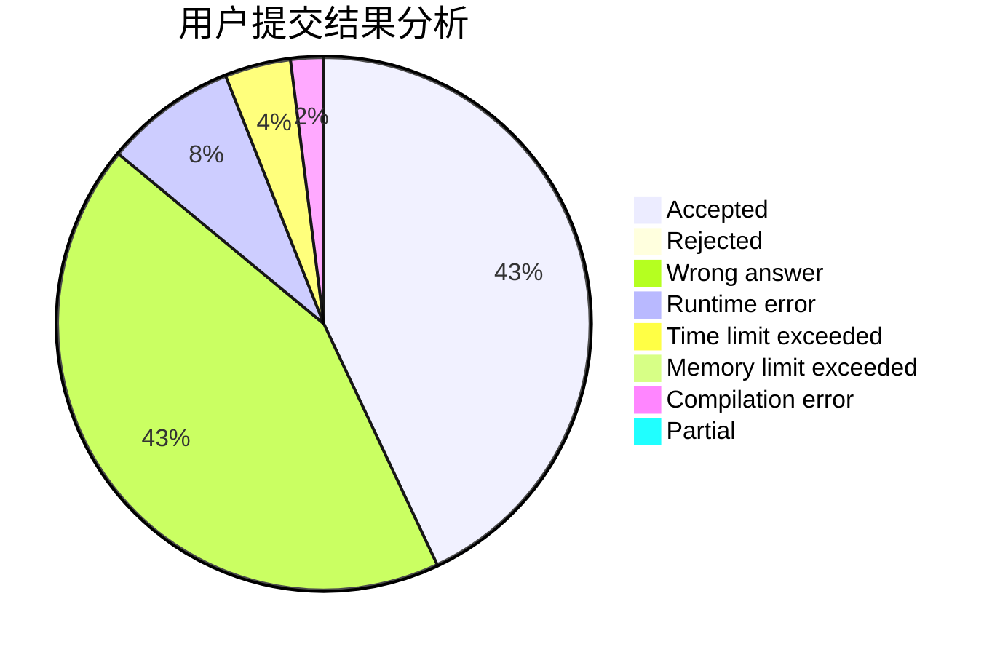
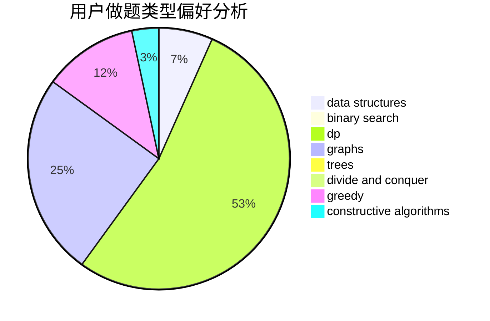

# funer

<!-- tabs:start -->

#### **用户提交结果分析**

#### **用户做题类型偏好分析**

#### **用户错题知识点分析**

<!-- tabs:end -->
# 推荐题目
[818F](https://codeforces.com/contest/818/problem/F)		binary search,
                        math,
                        ternary search		  
[911A](https://codeforces.com/contest/911/problem/A)		implementation		  
[1214E](https://codeforces.com/contest/1214/problem/E)		constructive algorithms,
                        graphs,
                        math,
                        sortings,
                        trees		  
[1347E](https://codeforces.com/contest/1347/problem/E)		dsu,graphs,sortings,trees		  
[102B](https://codeforces.com/contest/102/problem/B)		implementation		  
[1147F](https://codeforces.com/contest/1147/problem/F)		games,
                        interactive		  
[630C](https://codeforces.com/contest/630/problem/C)		combinatorics,
                        math		  
[222E](https://codeforces.com/contest/222/problem/E)		dp,
                        matrices		  
[741B](https://codeforces.com/contest/741/problem/B)		dfs and similar,
                        dp,
                        dsu		  
[1091C](https://codeforces.com/contest/1091/problem/C)		math,
                        number theory		  
