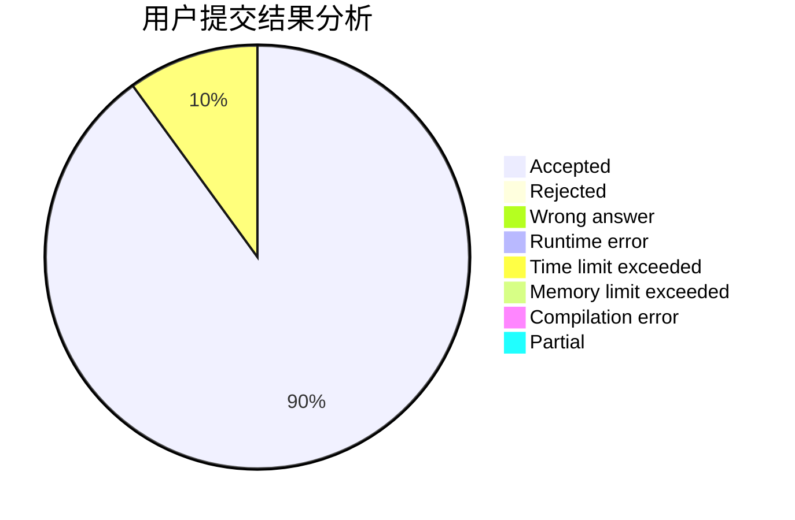
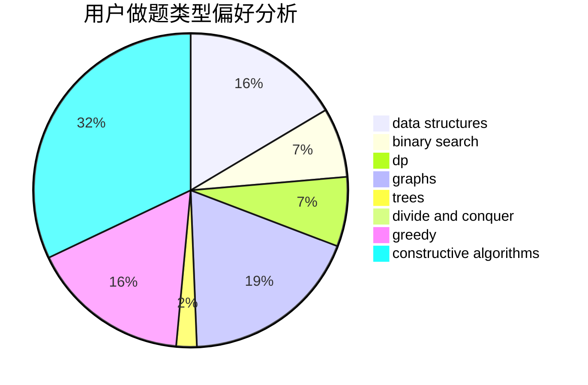

# fuxd

<!-- tabs:start -->

#### **用户提交结果分析**

#### **用户做题类型偏好分析**

#### **用户错题知识点分析**

<!-- tabs:end -->
# 推荐题目
[585F](https://codeforces.com/contest/585/problem/F)		dp,
                        implementation,
                        strings		  
[228B](https://codeforces.com/contest/228/problem/B)		brute force,
                        implementation		  
[797C](https://codeforces.com/contest/797/problem/C)		data structures,
                        greedy,
                        strings		  
[730J](https://codeforces.com/contest/730/problem/J)		dp		  
[614D](https://codeforces.com/contest/614/problem/D)		dsu,graphs,sortings,trees		  
[722C](https://codeforces.com/contest/722/problem/C)		data structures,
                        dsu		  
[843B](https://codeforces.com/contest/843/problem/B)		brute force,
                        interactive,
                        probabilities		  
[11732](https://codeforces.com/contest/1173/problem/2)		dsu,graphs,sortings,trees		  
[633B](https://codeforces.com/contest/633/problem/B)		brute force,
                        constructive algorithms,
                        math,
                        number theory		  
[164C](https://codeforces.com/contest/164/problem/C)		flows,
                        graphs		  
