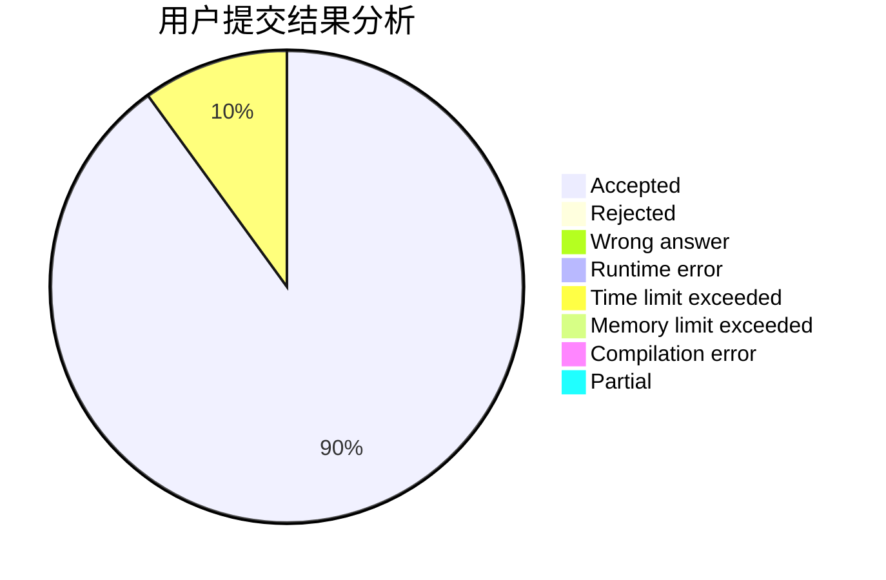
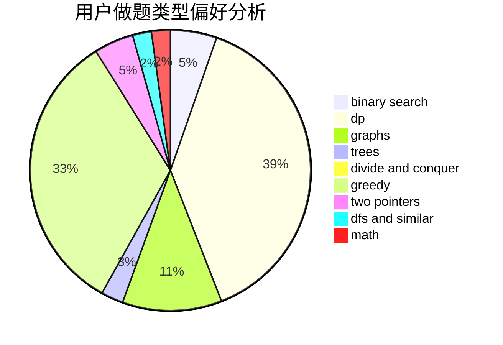

# fuxd

<!-- tabs:start -->

#### **用户提交结果分析**

#### **用户做题类型偏好分析**

<!-- tabs:end -->
# 推荐题目
[585F](https://codeforces.com/contest/585/problem/F)
[228B](https://codeforces.com/contest/228/problem/B)
[797C](https://codeforces.com/contest/797/problem/C)
[730J](https://codeforces.com/contest/730/problem/J)
[614D](https://codeforces.com/contest/614/problem/D)
[722C](https://codeforces.com/contest/722/problem/C)
[843B](https://codeforces.com/contest/843/problem/B)
[11732](https://codeforces.com/contest/1173/problem/2)
[633B](https://codeforces.com/contest/633/problem/B)
[164C](https://codeforces.com/contest/164/problem/C)
