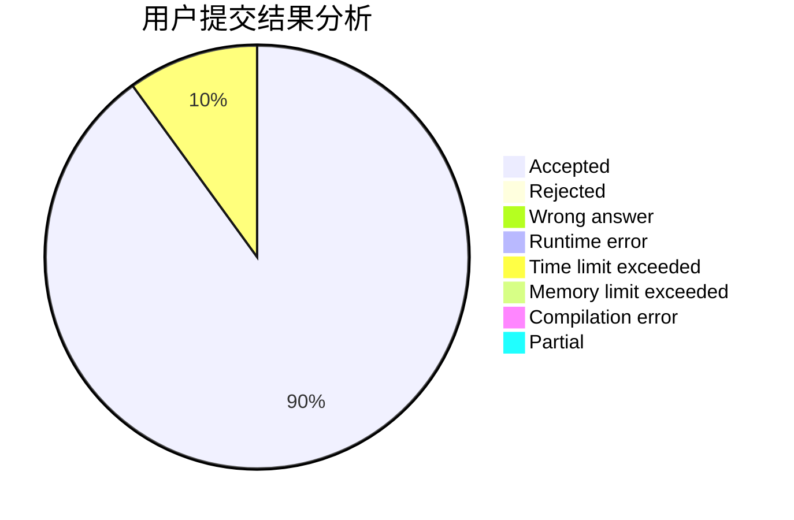
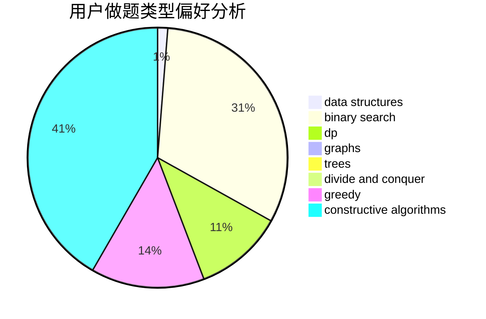

# fuxd

<!-- tabs:start -->

#### **用户提交结果分析**

#### **用户做题类型偏好分析**

#### **用户错题知识点分析**

<!-- tabs:end -->
# 推荐题目
[567A](https://codeforces.com/contest/567/problem/A)		greedy,
                        implementation		  
[204C](https://codeforces.com/contest/204/problem/C)		math,
                        probabilities		  
[779A](https://codeforces.com/contest/779/problem/A)		constructive algorithms,
                        math		  
[710F](https://codeforces.com/contest/710/problem/F)		brute force,
                        data structures,
                        hashing,
                        interactive,
                        string suffix structures,
                        strings		  
[597C](https://codeforces.com/contest/597/problem/C)		data structures,
                        dp		  
[703B](https://codeforces.com/contest/703/problem/B)		implementation,
                        math		  
[825B](https://codeforces.com/contest/825/problem/B)		brute force,
                        implementation		  
[1168C](https://codeforces.com/contest/1168/problem/C)		bitmasks,
                        dp		  
[614A](https://codeforces.com/contest/614/problem/A)		brute force,
                        implementation		  
[1510D](https://codeforces.com/contest/1510/problem/D)		dp,
                        math,
                        number theory		  
