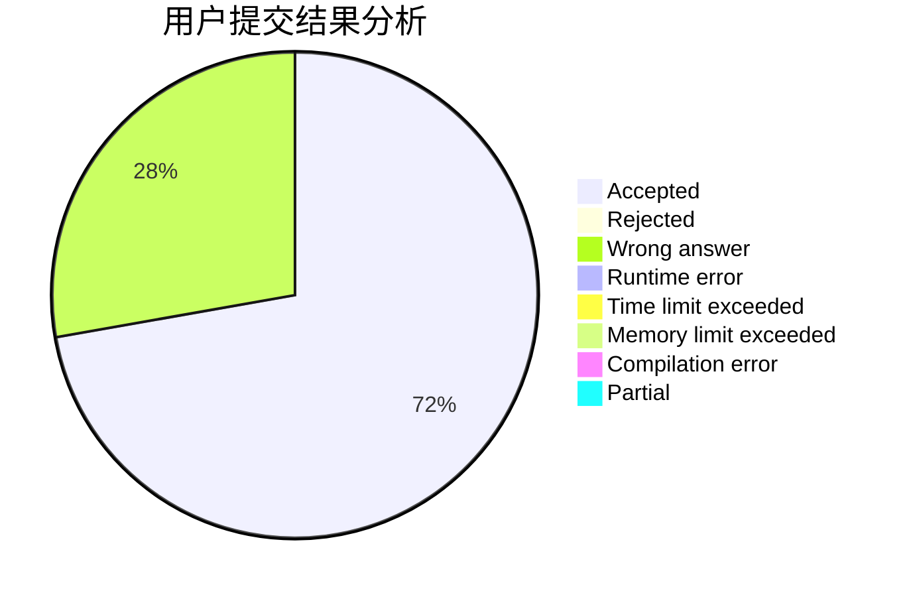
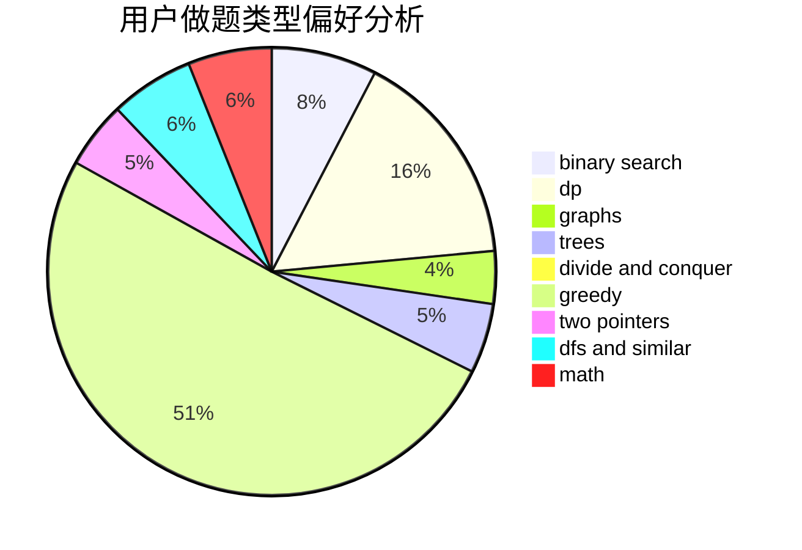

# fuxi

<!-- tabs:start -->

#### **用户提交结果分析**

#### **用户做题类型偏好分析**

<!-- tabs:end -->
# 推荐题目
[132C](https://codeforces.com/contest/132/problem/C)
[10922](https://codeforces.com/contest/1092/problem/2)
[1103D](https://codeforces.com/contest/1103/problem/D)
[1468N](https://codeforces.com/contest/1468/problem/N)
[190E](https://codeforces.com/contest/190/problem/E)
[11882](https://codeforces.com/contest/1188/problem/2)
[95A](https://codeforces.com/contest/95/problem/A)
[1444E](https://codeforces.com/contest/1444/problem/E)
[727F](https://codeforces.com/contest/727/problem/F)
[887F](https://codeforces.com/contest/887/problem/F)
