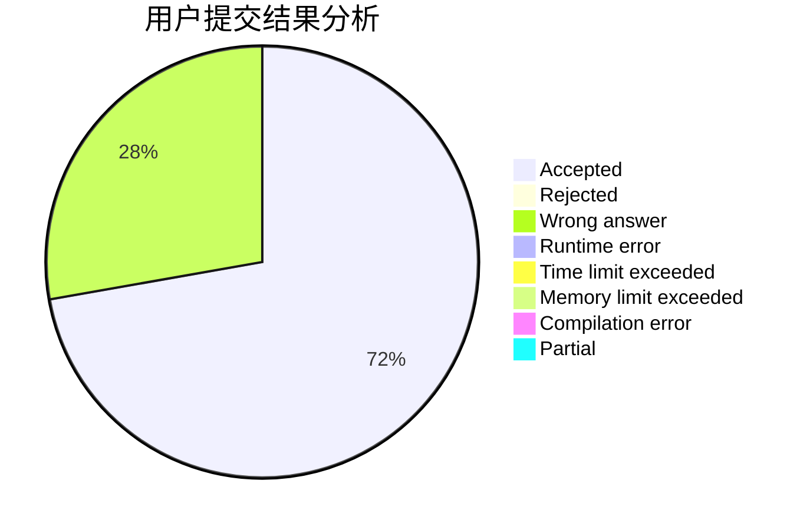
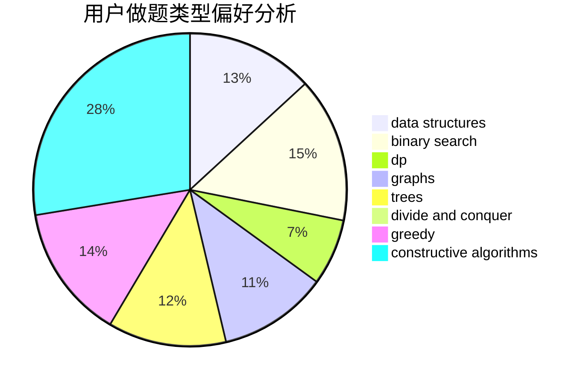
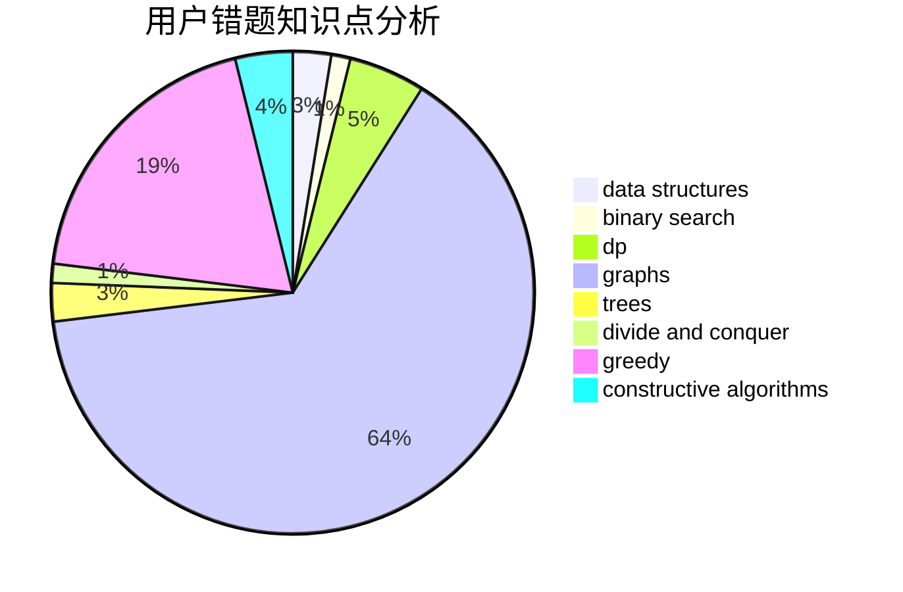

# fuxi

<!-- tabs:start -->

#### **用户提交结果分析**

#### **用户做题类型偏好分析**

#### **用户错题知识点分析**

<!-- tabs:end -->
# 推荐题目
[1323A](https://codeforces.com/contest/1323/problem/A)		brute force,
                        dp,
                        greedy,
                        implementation		  
[1091G](https://codeforces.com/contest/1091/problem/G)		interactive,
                        math,
                        number theory		  
[1103A](https://codeforces.com/contest/1103/problem/A)		constructive algorithms,
                        implementation		  
[1461D](https://codeforces.com/contest/1461/problem/D)		binary search,
                        brute force,
                        data structures,
                        divide and conquer,
                        implementation,
                        sortings		  
[165E](https://codeforces.com/contest/165/problem/E)		bitmasks,
                        brute force,
                        dfs and similar,
                        dp		  
[1184C3](https://codeforces.com/contest/1184C/problem/3)		nan		  
[938B](https://codeforces.com/contest/938/problem/B)		brute force,
                        greedy		  
[1434E](https://codeforces.com/contest/1434/problem/E)		dsu,
                        games		  
[708D](https://codeforces.com/contest/708/problem/D)		flows		  
[868D](https://codeforces.com/contest/868/problem/D)		bitmasks,
                        brute force,
                        dp,
                        implementation,
                        strings		  
