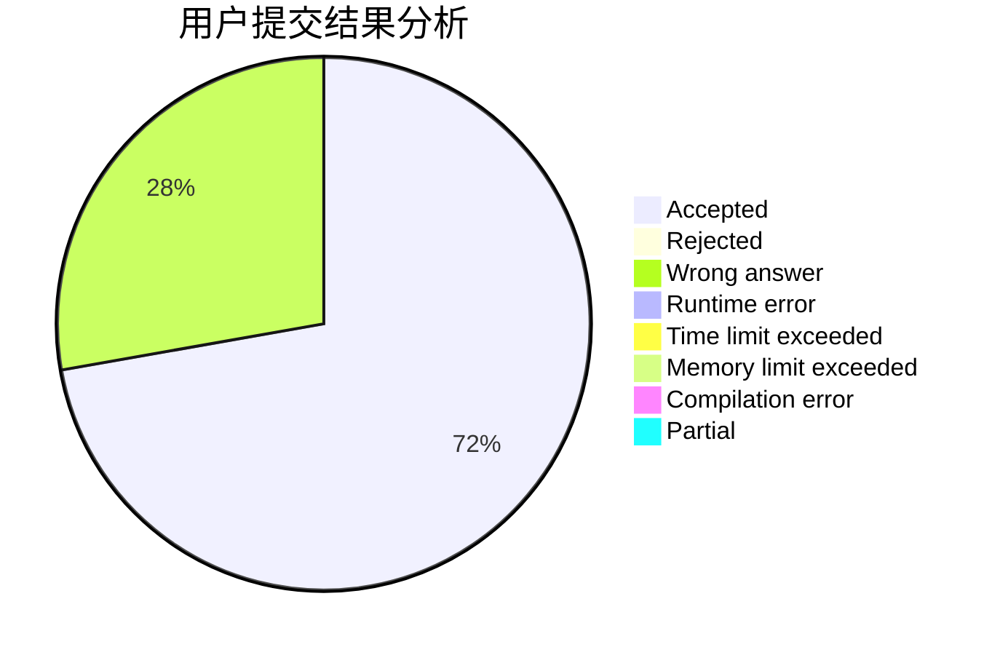
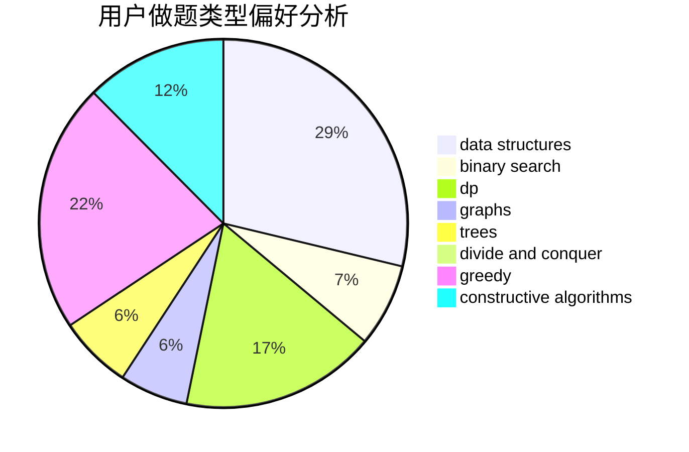
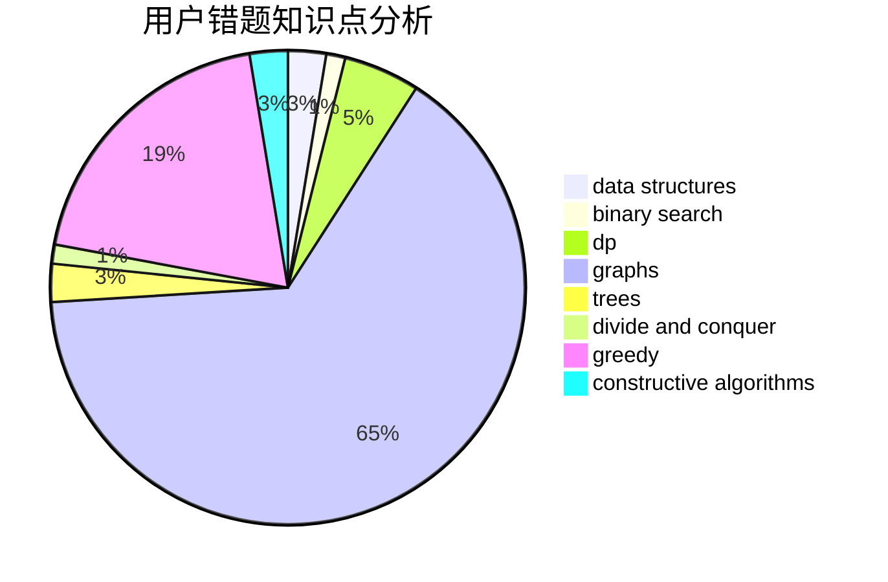

# fuxi

<!-- tabs:start -->

#### **用户提交结果分析**

#### **用户做题类型偏好分析**

#### **用户错题知识点分析**

<!-- tabs:end -->
# 推荐题目
[132C](https://codeforces.com/contest/132/problem/C)		dp		  
[10922](https://codeforces.com/contest/1092/problem/2)		dsu,graphs,sortings,trees		  
[1103D](https://codeforces.com/contest/1103/problem/D)		bitmasks,
                        dp		  
[1468N](https://codeforces.com/contest/1468/problem/N)		greedy,
                        implementation		  
[190E](https://codeforces.com/contest/190/problem/E)		data structures,
                        dsu,
                        graphs,
                        hashing,
                        sortings		  
[11882](https://codeforces.com/contest/1188/problem/2)		dsu,graphs,sortings,trees		  
[95A](https://codeforces.com/contest/95/problem/A)		implementation,
                        strings		  
[1444E](https://codeforces.com/contest/1444/problem/E)		brute force,
                        dfs and similar,
                        dp,
                        interactive,
                        trees		  
[727F](https://codeforces.com/contest/727/problem/F)		binary search,
                        dp,
                        greedy		  
[887F](https://codeforces.com/contest/887/problem/F)		greedy,
                        sortings		  
