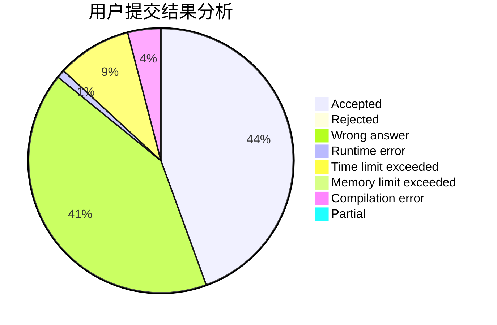
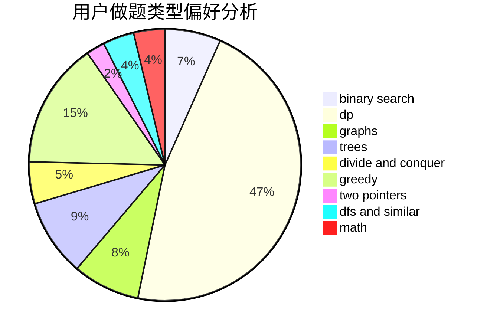

# 11D_Beyonder

<!-- tabs:start -->

#### **用户提交结果分析**

#### **用户做题类型偏好分析**

<!-- tabs:end -->
# 推荐题目
[1107C](https://codeforces.com/contest/1107/problem/C)
[1110D](https://codeforces.com/contest/1110/problem/D)
[1108A](https://codeforces.com/contest/1108/problem/A)
[1104C](https://codeforces.com/contest/1104/problem/C)
[1041C](https://codeforces.com/contest/1041/problem/C)
[1106E](https://codeforces.com/contest/1106/problem/E)
[11082](https://codeforces.com/contest/1108/problem/2)
[1104E](https://codeforces.com/contest/1104/problem/E)
[1105D](https://codeforces.com/contest/1105/problem/D)
[1109B](https://codeforces.com/contest/1109/problem/B)
