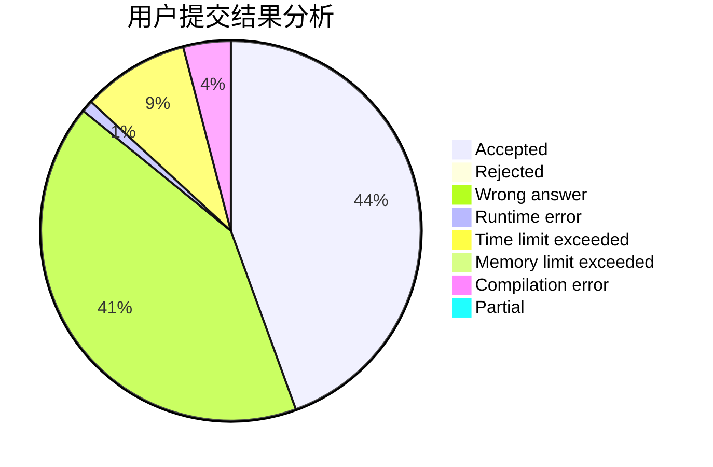
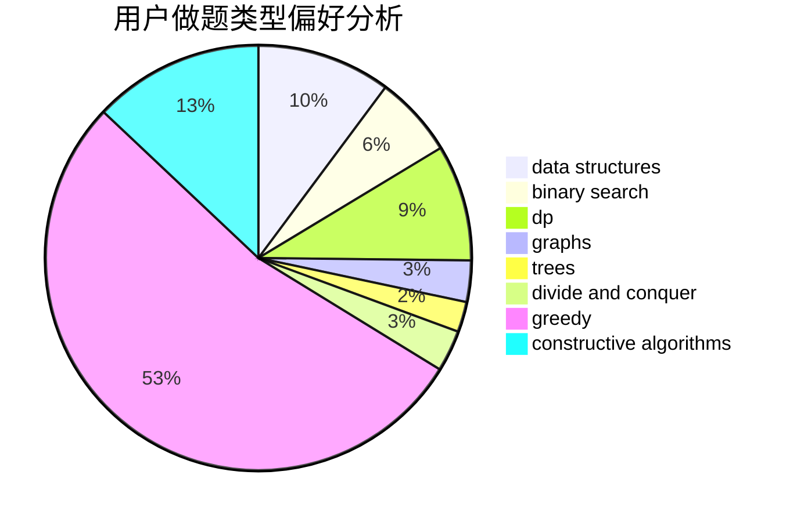
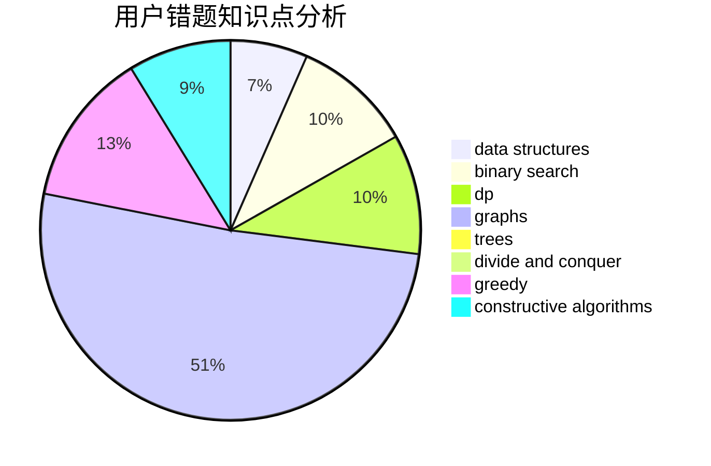

# 11D_Beyonder

<!-- tabs:start -->

#### **用户提交结果分析**

#### **用户做题类型偏好分析**

#### **用户错题知识点分析**

<!-- tabs:end -->
# 推荐题目
[1106F](https://codeforces.com/contest/1106/problem/F)		math,
                        matrices,
                        number theory		  
[1110A](https://codeforces.com/contest/1110/problem/A)		math		  
[1107F](https://codeforces.com/contest/1107/problem/F)		dp,
                        flows,
                        graph matchings,
                        graphs,
                        sortings		  
[1103E](https://codeforces.com/contest/1103/problem/E)		fft,
                        math,
                        number theory		  
[1040D](https://codeforces.com/contest/1040/problem/D)		dsu,graphs,sortings,trees		  
[1106B](https://codeforces.com/contest/1106/problem/B)		data structures,
                        implementation		  
[1107E](https://codeforces.com/contest/1107/problem/E)		dp		  
[1104B](https://codeforces.com/contest/1104/problem/B)		data structures,
                        implementation,
                        math		  
[1105A](https://codeforces.com/contest/1105/problem/A)		brute force,
                        implementation		  
[1108E2](https://codeforces.com/contest/1108E/problem/2)		data structures,
                        implementation		  
