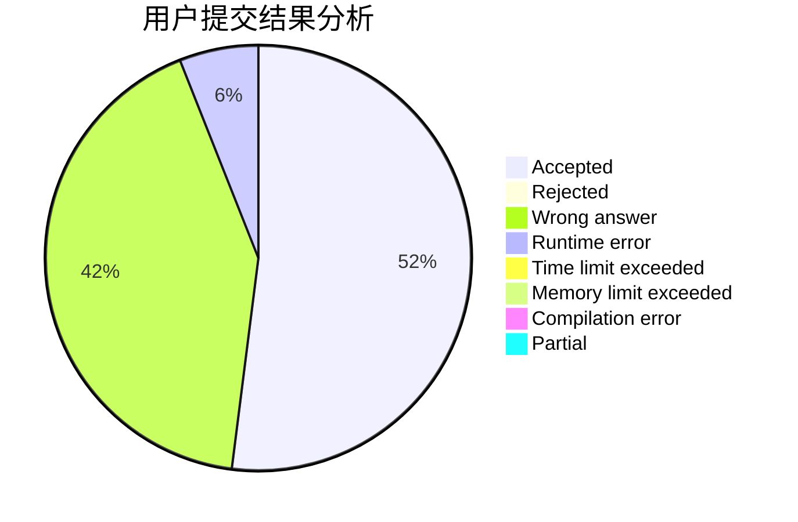
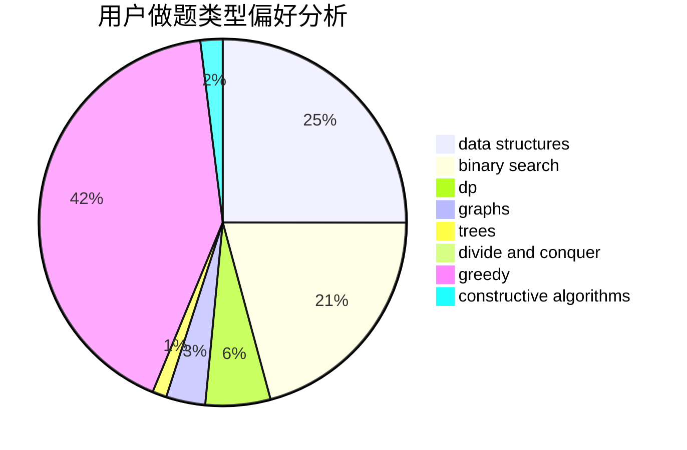
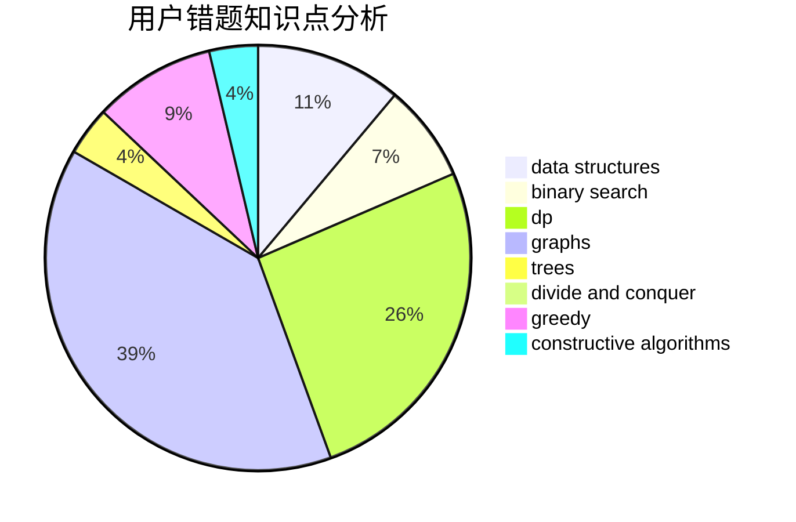

# Axsel_blaze

<!-- tabs:start -->

#### **用户提交结果分析**

#### **用户做题类型偏好分析**

#### **用户错题知识点分析**

<!-- tabs:end -->
# 推荐题目
[1092E](https://codeforces.com/contest/1092/problem/E)		constructive algorithms,
                        dfs and similar,
                        greedy,
                        trees		  
[229D](https://codeforces.com/contest/229/problem/D)		dp,
                        greedy,
                        two pointers		  
[449B](https://codeforces.com/contest/449/problem/B)		graphs,
                        greedy,
                        shortest paths		  
[44G](https://codeforces.com/contest/44/problem/G)		data structures,
                        implementation		  
[44B](https://codeforces.com/contest/44/problem/B)		implementation		  
[450B](https://codeforces.com/contest/450/problem/B)		implementation,
                        math		  
[1269A](https://codeforces.com/contest/1269/problem/A)		brute force,
                        math		  
[1030D](https://codeforces.com/contest/1030/problem/D)		geometry,
                        number theory		  
[1206B](https://codeforces.com/contest/1206/problem/B)		dp,
                        implementation		  
[1376B4](https://codeforces.com/contest/1376B/problem/4)		dsu,graphs,sortings,trees		  
