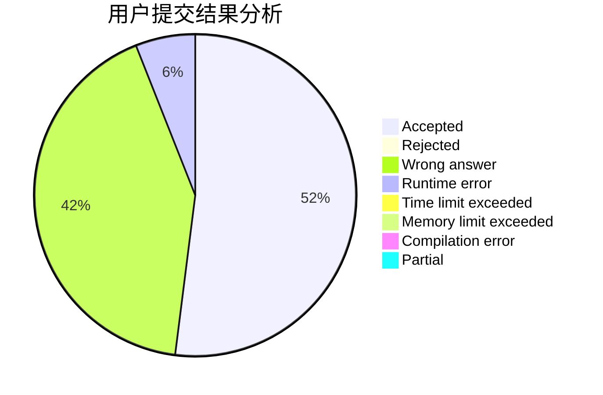
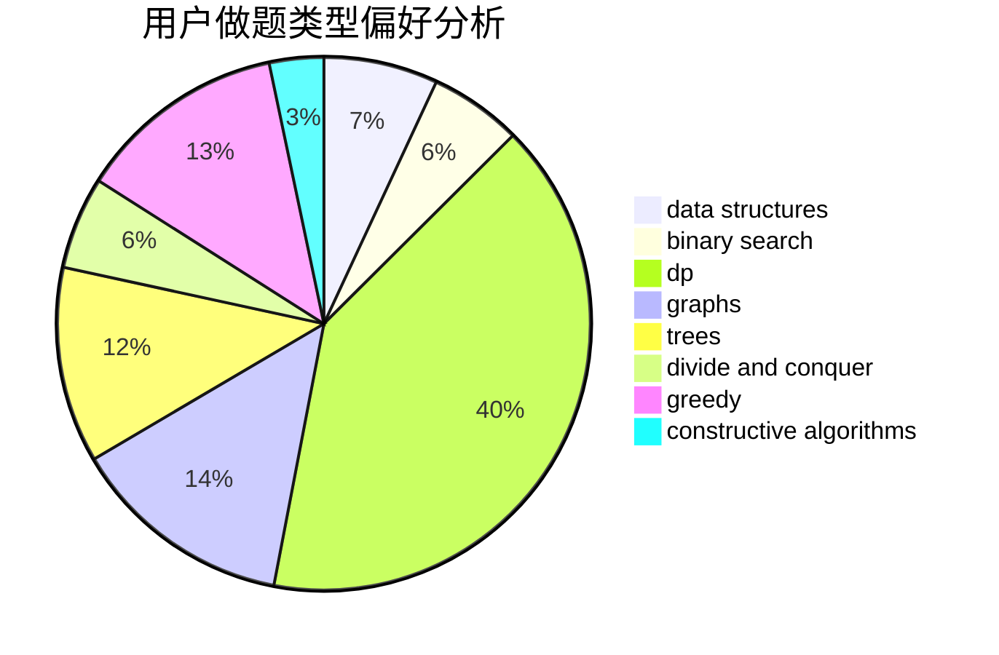

# Axsel_blaze

<!-- tabs:start -->

#### **用户提交结果分析**

#### **用户做题类型偏好分析**

#### **用户错题知识点分析**

<!-- tabs:end -->
# 推荐题目
[1093B](https://codeforces.com/contest/1093/problem/B)		constructive algorithms,
                        greedy,
                        sortings,
                        strings		  
[249E](https://codeforces.com/contest/249/problem/E)		math		  
[468E](https://codeforces.com/contest/468/problem/E)		dp,
                        graph matchings,
                        math,
                        meet-in-the-middle		  
[472A](https://codeforces.com/contest/472/problem/A)		math,
                        number theory		  
[471A](https://codeforces.com/contest/471/problem/A)		implementation		  
[472C](https://codeforces.com/contest/472/problem/C)		greedy		  
[1278A](https://codeforces.com/contest/1278/problem/A)		brute force,
                        implementation,
                        strings		  
[1031A](https://codeforces.com/contest/1031/problem/A)		implementation,
                        math		  
[1210C](https://codeforces.com/contest/1210/problem/C)		math,
                        number theory,
                        trees		  
[1386A](https://codeforces.com/contest/1386/problem/A)		*special problem,
                        binary search,
                        constructive algorithms,
                        interactive		  
