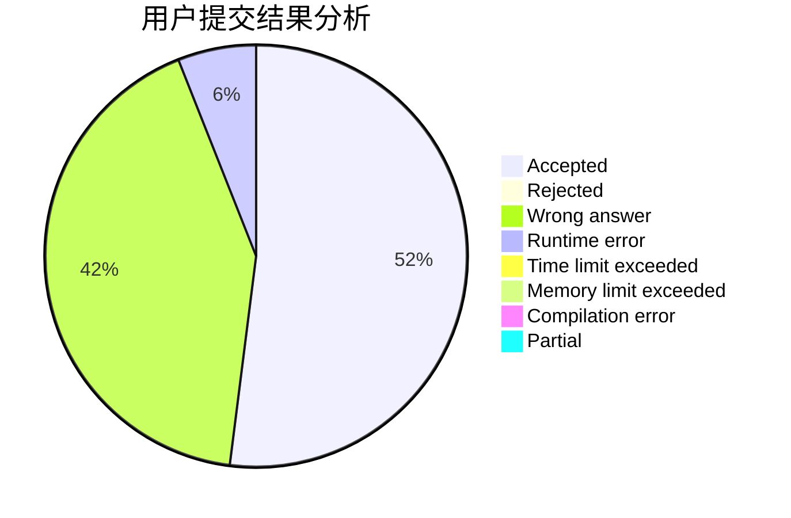
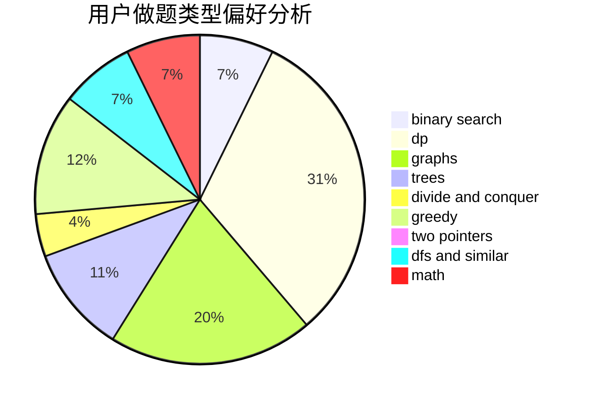

# Axsel_blaze

<!-- tabs:start -->

#### **用户提交结果分析**

#### **用户做题类型偏好分析**

<!-- tabs:end -->
# 推荐题目
[1093B](https://codeforces.com/contest/1093/problem/B)
[249E](https://codeforces.com/contest/249/problem/E)
[468E](https://codeforces.com/contest/468/problem/E)
[472A](https://codeforces.com/contest/472/problem/A)
[471A](https://codeforces.com/contest/471/problem/A)
[472C](https://codeforces.com/contest/472/problem/C)
[1278A](https://codeforces.com/contest/1278/problem/A)
[1031A](https://codeforces.com/contest/1031/problem/A)
[1210C](https://codeforces.com/contest/1210/problem/C)
[1386A](https://codeforces.com/contest/1386/problem/A)
