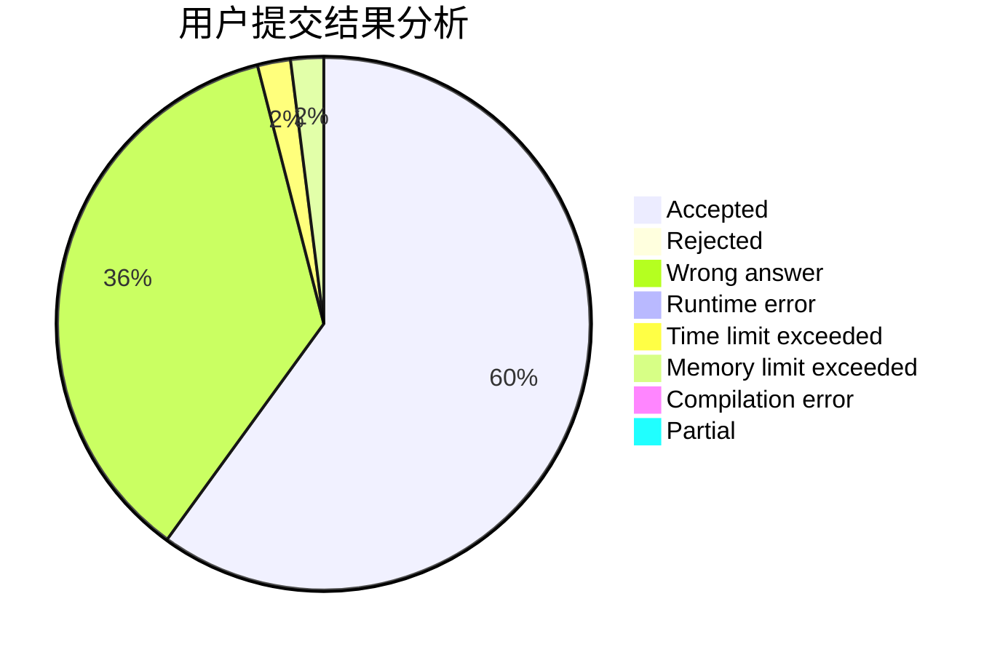
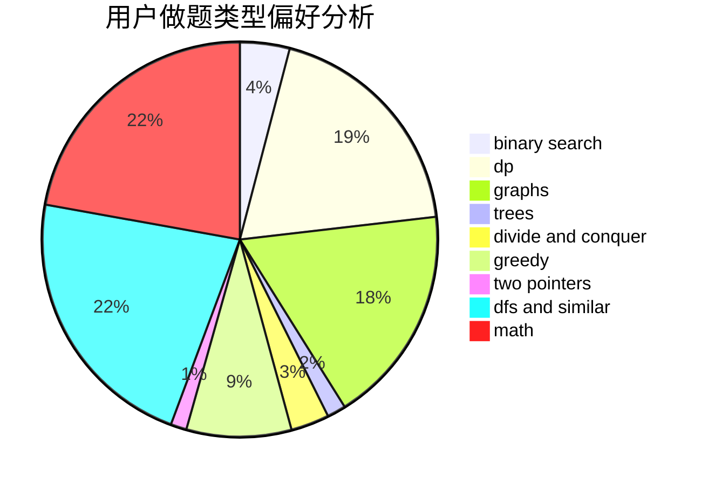

# gang_leader

<!-- tabs:start -->

#### **用户提交结果分析**

#### **用户做题类型偏好分析**

<!-- tabs:end -->
# 推荐题目
[700E](https://codeforces.com/contest/700/problem/E)
[1407A](https://codeforces.com/contest/1407/problem/A)
[226D](https://codeforces.com/contest/226/problem/D)
[543B](https://codeforces.com/contest/543/problem/B)
[436A](https://codeforces.com/contest/436/problem/A)
[772A](https://codeforces.com/contest/772/problem/A)
[1302F](https://codeforces.com/contest/1302/problem/F)
[827F](https://codeforces.com/contest/827/problem/F)
[498A](https://codeforces.com/contest/498/problem/A)
[1084B](https://codeforces.com/contest/1084/problem/B)
