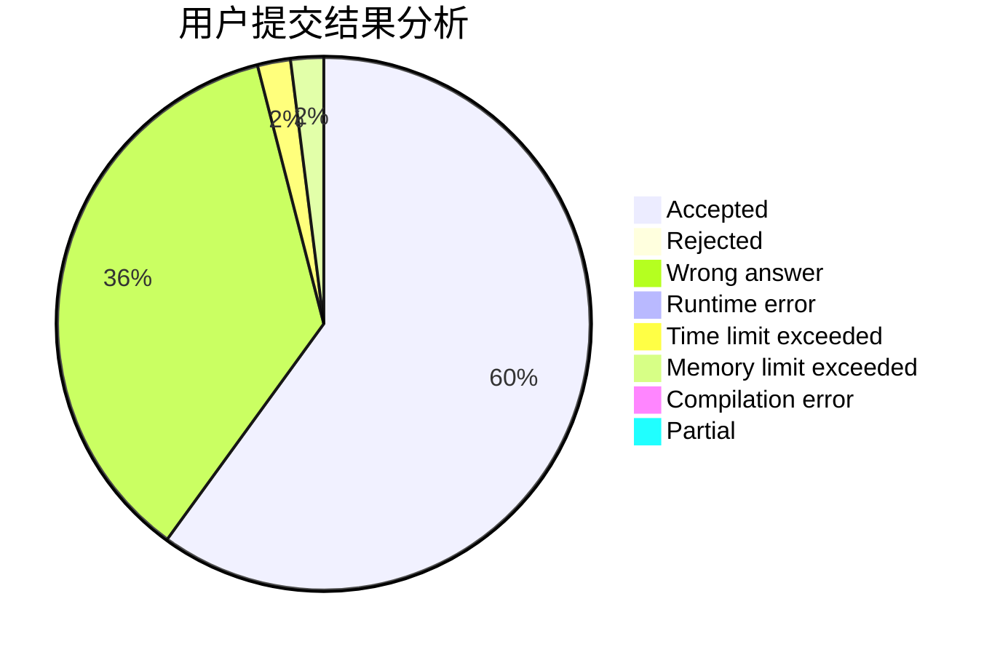
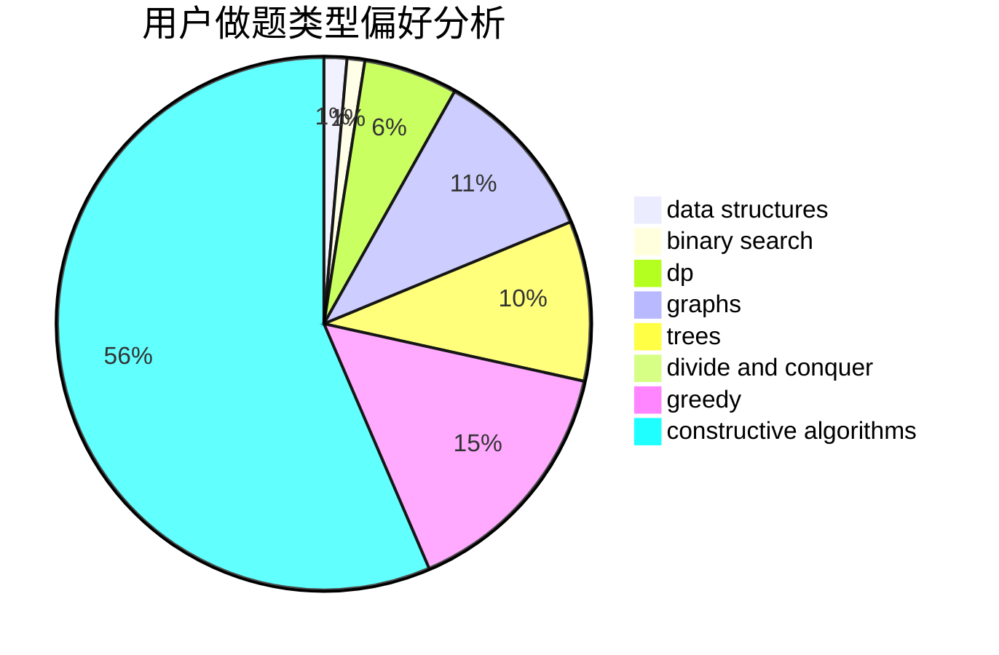
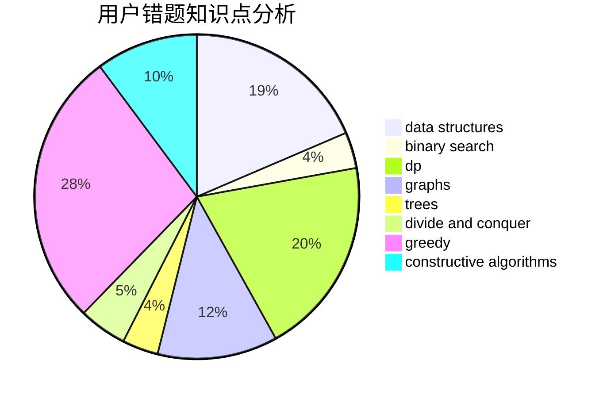

# gang_leader

<!-- tabs:start -->

#### **用户提交结果分析**

#### **用户做题类型偏好分析**

#### **用户错题知识点分析**

<!-- tabs:end -->
# 推荐题目
[676E](https://codeforces.com/contest/676/problem/E)		math		  
[1398B](https://codeforces.com/contest/1398/problem/B)		games,
                        greedy,
                        sortings		  
[201D](https://codeforces.com/contest/201/problem/D)		bitmasks,
                        brute force,
                        dp		  
[516B](https://codeforces.com/contest/516/problem/B)		dsu,graphs,sortings,trees		  
[407B](https://codeforces.com/contest/407/problem/B)		dp,
                        implementation		  
[754A](https://codeforces.com/contest/754/problem/A)		constructive algorithms,
                        greedy,
                        implementation		  
[1295D](https://codeforces.com/contest/1295/problem/D)		math,
                        number theory		  
[80B](https://codeforces.com/contest/80/problem/B)		geometry,
                        math		  
[478A](https://codeforces.com/contest/478/problem/A)		implementation		  
[1083D](https://codeforces.com/contest/1083/problem/D)		data structures,
                        implementation		  
