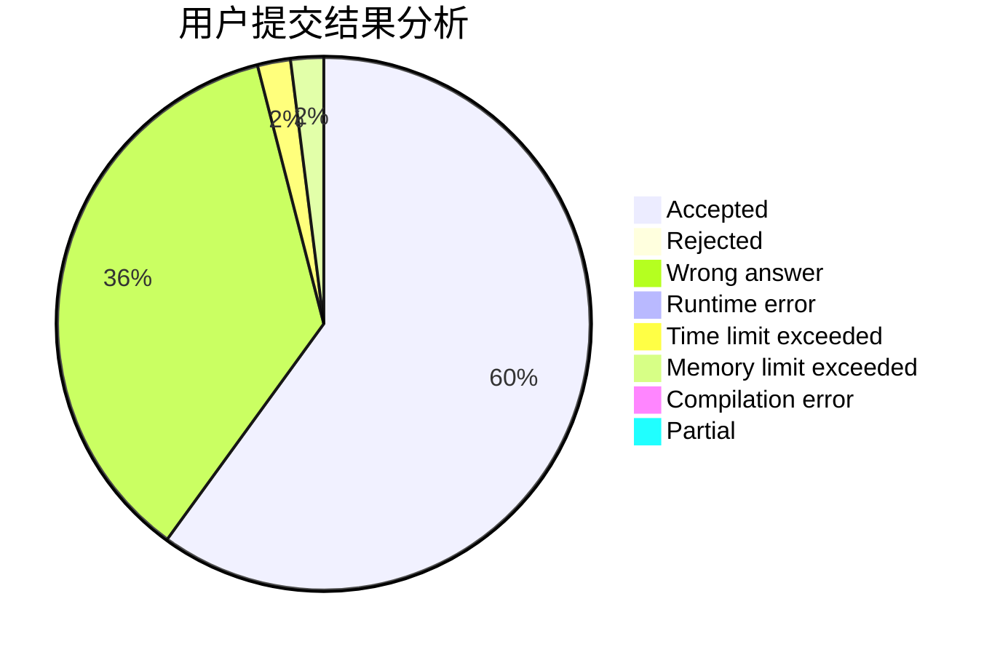
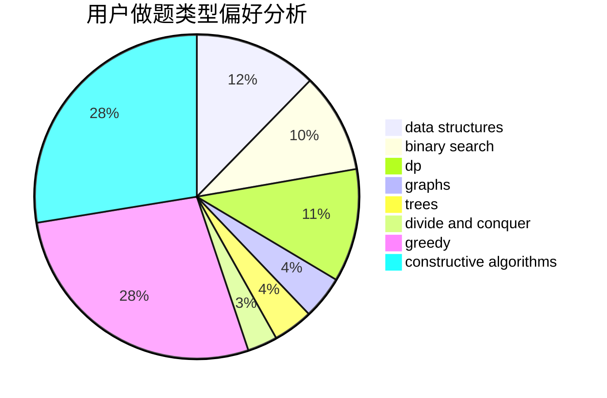
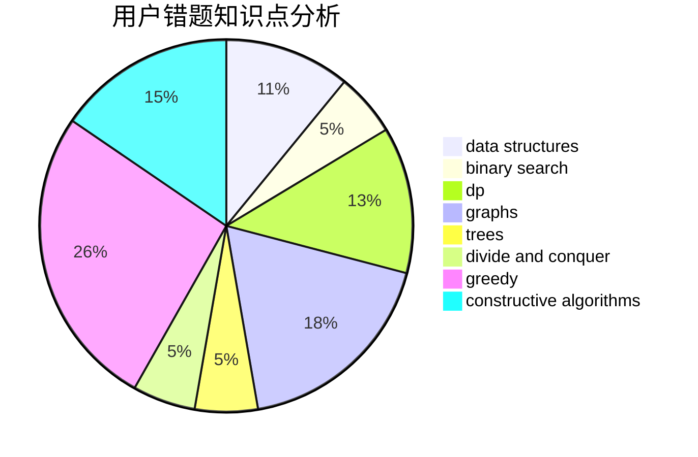

# gang_leader

<!-- tabs:start -->

#### **用户提交结果分析**

#### **用户做题类型偏好分析**

#### **用户错题知识点分析**

<!-- tabs:end -->
# 推荐题目
[700E](https://codeforces.com/contest/700/problem/E)		string suffix structures,
                        strings		  
[1407A](https://codeforces.com/contest/1407/problem/A)		constructive algorithms,
                        math		  
[226D](https://codeforces.com/contest/226/problem/D)		constructive algorithms,
                        greedy		  
[543B](https://codeforces.com/contest/543/problem/B)		constructive algorithms,
                        graphs,
                        shortest paths		  
[436A](https://codeforces.com/contest/436/problem/A)		greedy		  
[772A](https://codeforces.com/contest/772/problem/A)		binary search,
                        math		  
[1302F](https://codeforces.com/contest/1302/problem/F)		bitmasks,
                        brute force,
                        expression parsing		  
[827F](https://codeforces.com/contest/827/problem/F)		data structures,
                        dp,
                        graphs,
                        shortest paths		  
[498A](https://codeforces.com/contest/498/problem/A)		geometry		  
[1084B](https://codeforces.com/contest/1084/problem/B)		greedy,
                        implementation		  
