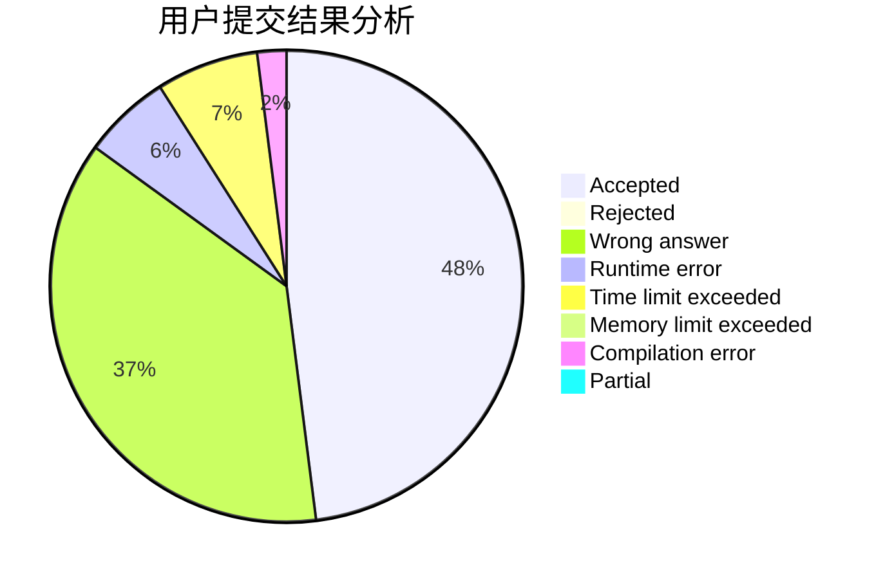
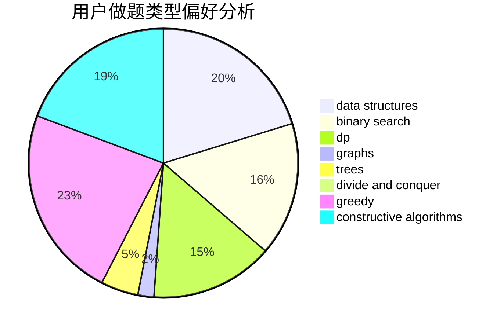
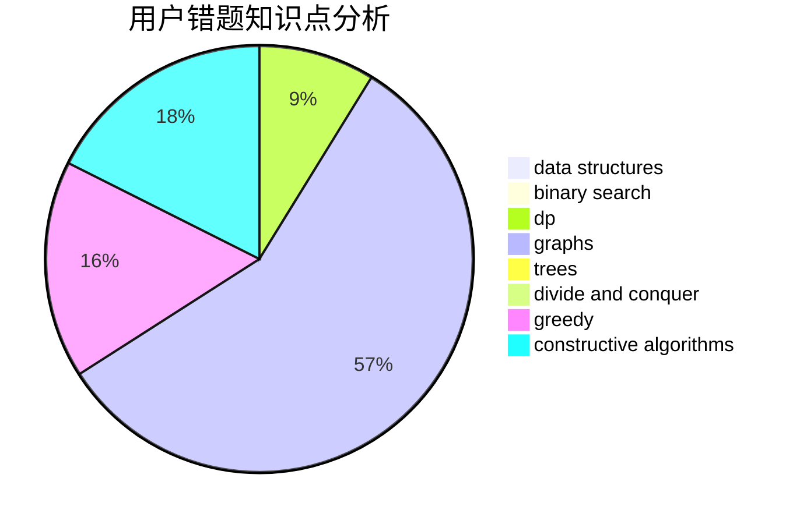

# gangpener

<!-- tabs:start -->

#### **用户提交结果分析**

#### **用户做题类型偏好分析**

#### **用户错题知识点分析**

<!-- tabs:end -->
# 推荐题目
[1437A](https://codeforces.com/contest/1437/problem/A)		brute force,
                        constructive algorithms,
                        greedy,
                        math		  
[520A](https://codeforces.com/contest/520/problem/A)		implementation,
                        strings		  
[1078D](https://codeforces.com/contest/1078/problem/D)		dsu,graphs,sortings,trees		  
[1020C](https://codeforces.com/contest/1020/problem/C)		dsu,graphs,sortings,trees		  
[888F](https://codeforces.com/contest/888/problem/F)		dp,
                        graphs		  
[1089A](https://codeforces.com/contest/1089/problem/A)		dp		  
[784F](https://codeforces.com/contest/784/problem/F)		*special problem,
                        implementation		  
[734A](https://codeforces.com/contest/734/problem/A)		implementation,
                        strings		  
[383A](https://codeforces.com/contest/383/problem/A)		data structures,
                        greedy		  
[76D](https://codeforces.com/contest/76/problem/D)		dp,
                        greedy,
                        math		  
