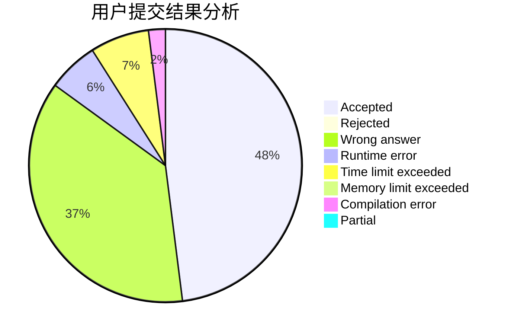
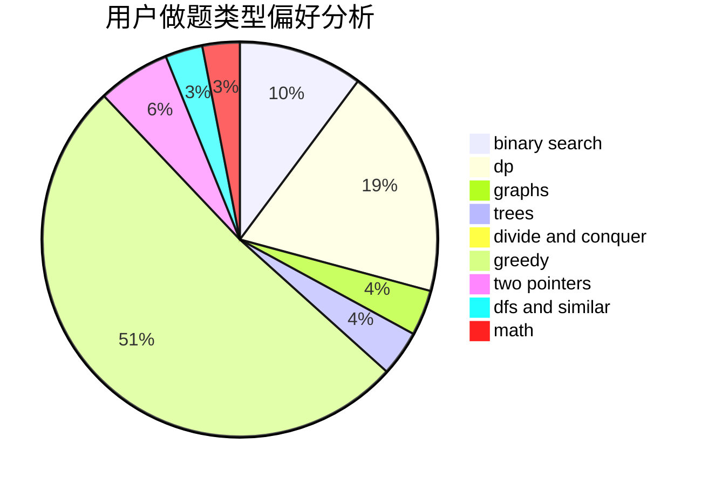

# gangpener

<!-- tabs:start -->

#### **用户提交结果分析**

#### **用户做题类型偏好分析**

<!-- tabs:end -->
# 推荐题目
[1437A](https://codeforces.com/contest/1437/problem/A)
[520A](https://codeforces.com/contest/520/problem/A)
[1078D](https://codeforces.com/contest/1078/problem/D)
[1020C](https://codeforces.com/contest/1020/problem/C)
[888F](https://codeforces.com/contest/888/problem/F)
[1089A](https://codeforces.com/contest/1089/problem/A)
[784F](https://codeforces.com/contest/784/problem/F)
[734A](https://codeforces.com/contest/734/problem/A)
[383A](https://codeforces.com/contest/383/problem/A)
[76D](https://codeforces.com/contest/76/problem/D)
