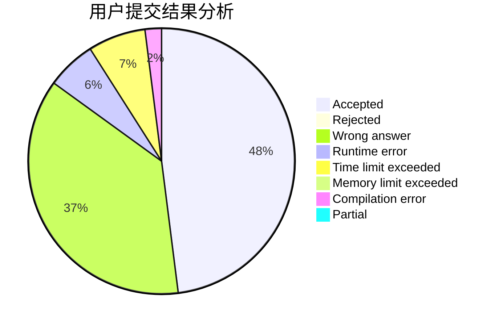
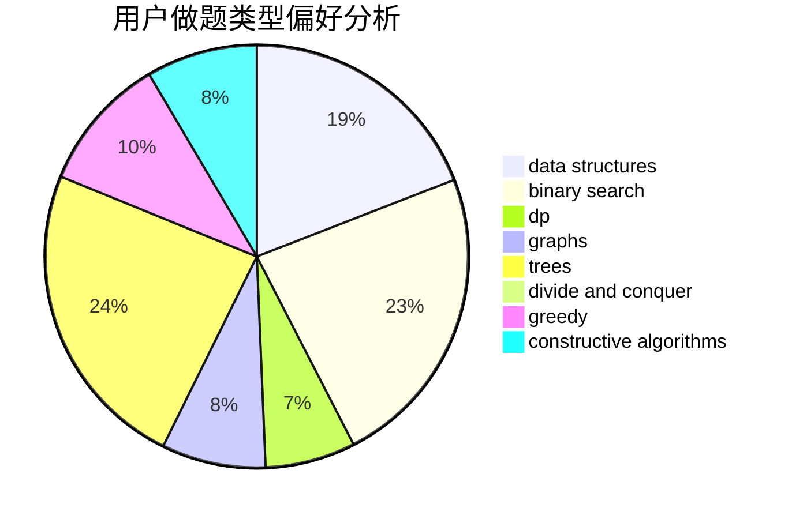
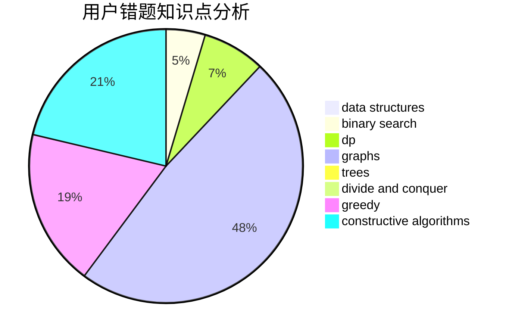

# gangpener

<!-- tabs:start -->

#### **用户提交结果分析**

#### **用户做题类型偏好分析**

#### **用户错题知识点分析**

<!-- tabs:end -->
# 推荐题目
[1428A](https://codeforces.com/contest/1428/problem/A)		math		  
[4A](https://codeforces.com/contest/4/problem/A)		brute force,
                        math		  
[1078A](https://codeforces.com/contest/1078/problem/A)		dsu,graphs,sortings,trees		  
[101D](https://codeforces.com/contest/101/problem/D)		dp,
                        greedy,
                        probabilities,
                        sortings,
                        trees		  
[869C](https://codeforces.com/contest/869/problem/C)		combinatorics,
                        dp,
                        math		  
[1088D](https://codeforces.com/contest/1088/problem/D)		bitmasks,
                        constructive algorithms,
                        implementation,
                        interactive		  
[765C](https://codeforces.com/contest/765/problem/C)		math		  
[716A](https://codeforces.com/contest/716/problem/A)		implementation		  
[356E](https://codeforces.com/contest/356/problem/E)		dp,
                        hashing,
                        implementation,
                        string suffix structures,
                        strings		  
[750D](https://codeforces.com/contest/750/problem/D)		brute force,
                        data structures,
                        dfs and similar,
                        dp,
                        implementation		  
