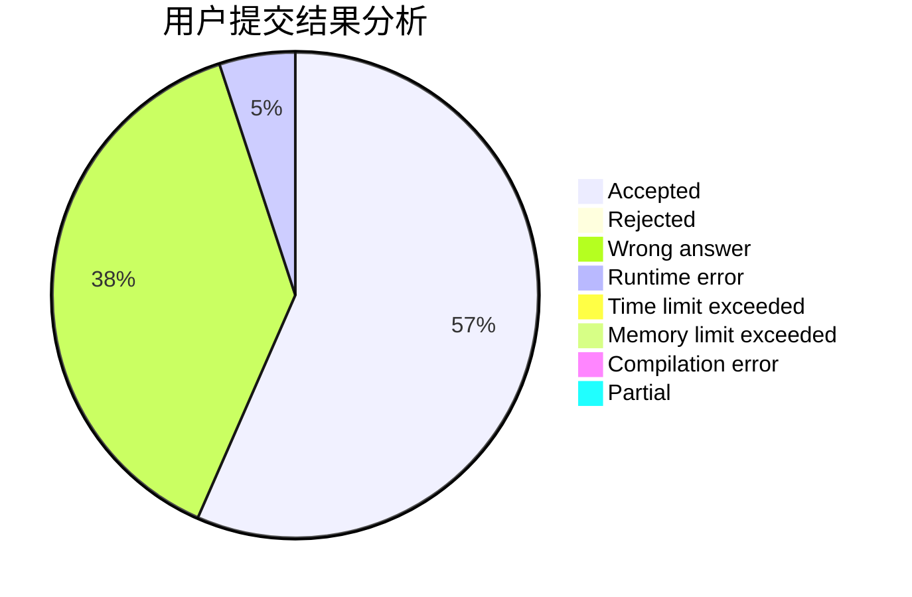
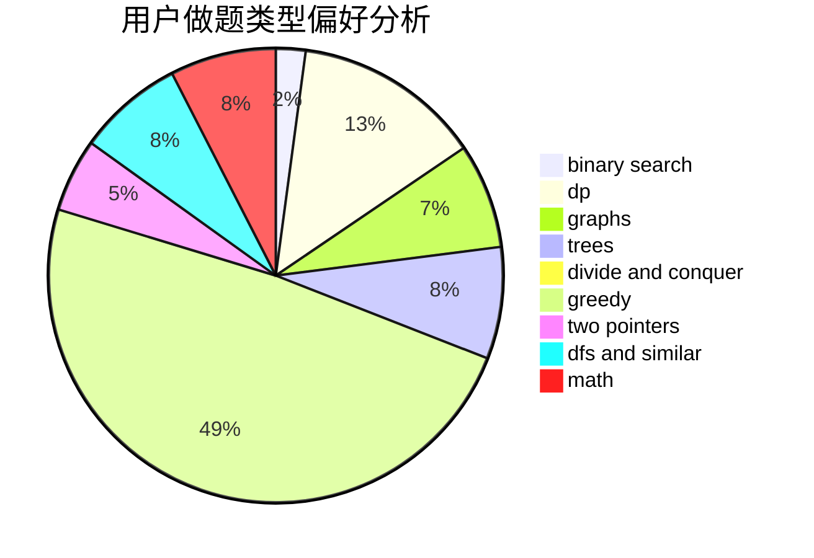

# gangpenwang

<!-- tabs:start -->

#### **用户提交结果分析**

#### **用户做题类型偏好分析**

<!-- tabs:end -->
# 推荐题目
[1399F](https://codeforces.com/contest/1399/problem/F)
[582A](https://codeforces.com/contest/582/problem/A)
[1154G](https://codeforces.com/contest/1154/problem/G)
[782E](https://codeforces.com/contest/782/problem/E)
[665C](https://codeforces.com/contest/665/problem/C)
[1236B](https://codeforces.com/contest/1236/problem/B)
[763D](https://codeforces.com/contest/763/problem/D)
[152E](https://codeforces.com/contest/152/problem/E)
[362C](https://codeforces.com/contest/362/problem/C)
[521B](https://codeforces.com/contest/521/problem/B)
