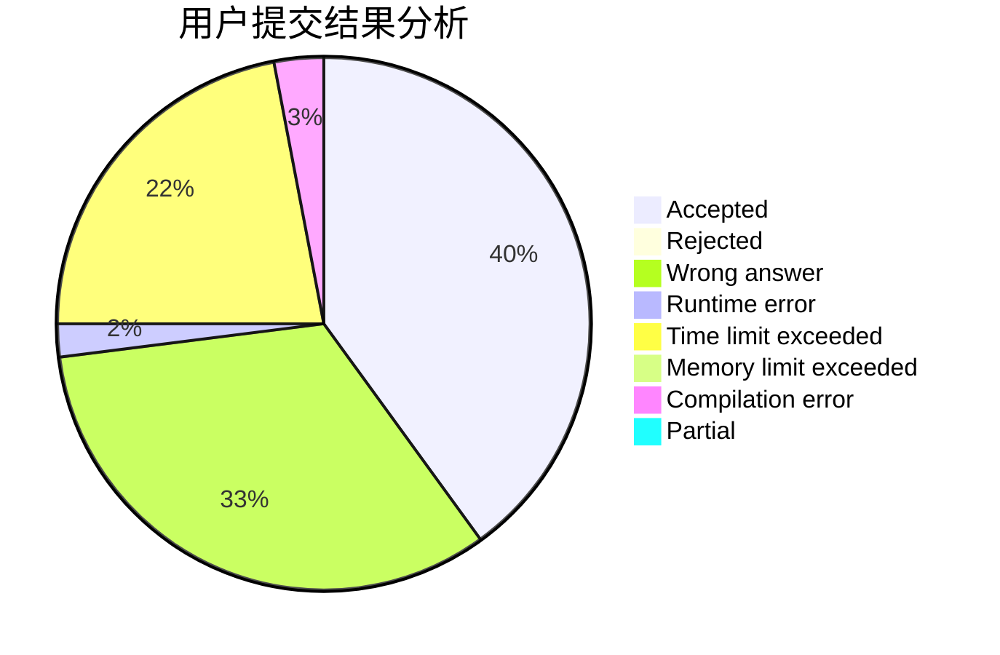
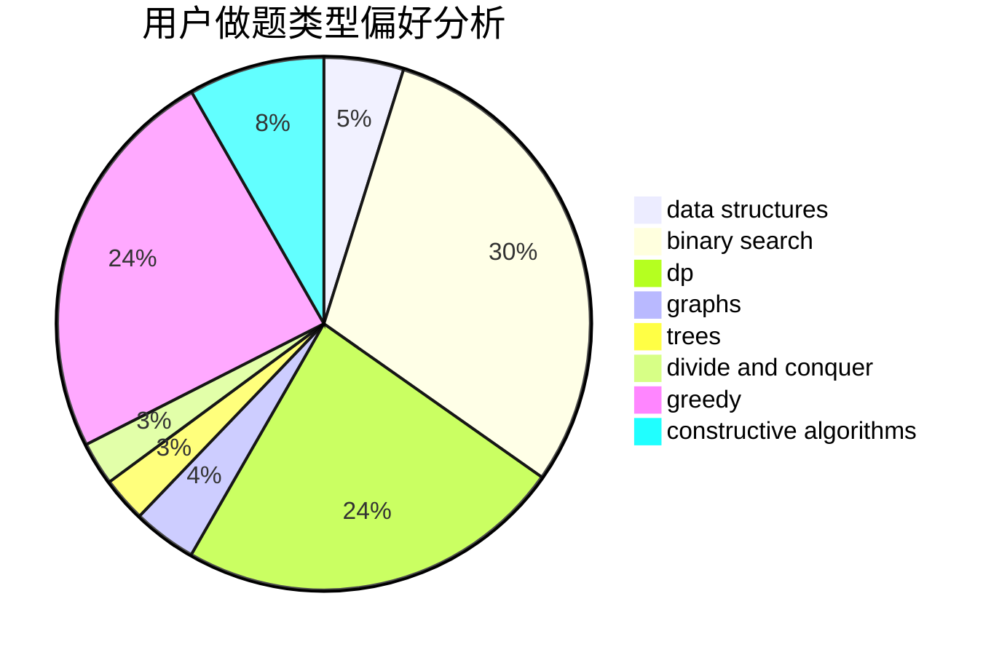
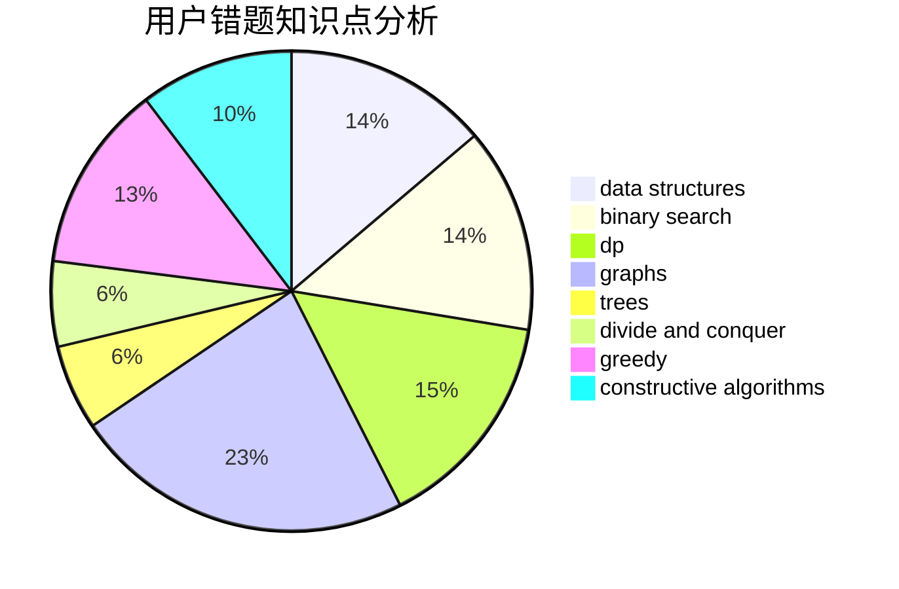

# get_r_ight

<!-- tabs:start -->

#### **用户提交结果分析**

#### **用户做题类型偏好分析**

#### **用户错题知识点分析**

<!-- tabs:end -->
# 推荐题目
[1129D](https://codeforces.com/contest/1129/problem/D)		data structures,
                        dp		  
[721C](https://codeforces.com/contest/721/problem/C)		dp,
                        graphs		  
[1182F](https://codeforces.com/contest/1182/problem/F)		binary search,
                        data structures,
                        number theory		  
[567B](https://codeforces.com/contest/567/problem/B)		implementation		  
[1389E](https://codeforces.com/contest/1389/problem/E)		math,
                        number theory		  
[948A](https://codeforces.com/contest/948/problem/A)		brute force,
                        dfs and similar,
                        graphs,
                        implementation		  
[1474F](https://codeforces.com/contest/1474/problem/F)		dp,
                        math,
                        matrices		  
[678B](https://codeforces.com/contest/678/problem/B)		implementation		  
[860D](https://codeforces.com/contest/860/problem/D)		dsu,graphs,sortings,trees		  
[1286A](https://codeforces.com/contest/1286/problem/A)		dp,
                        greedy,
                        sortings		  
