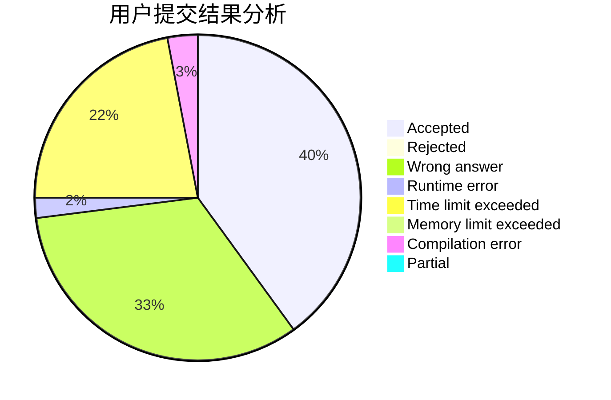
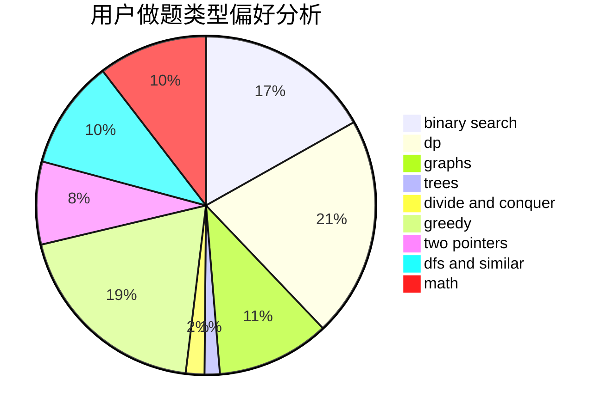

# get_r_ight

<!-- tabs:start -->

#### **用户提交结果分析**

#### **用户做题类型偏好分析**

<!-- tabs:end -->
# 推荐题目
[1129D](https://codeforces.com/contest/1129/problem/D)
[721C](https://codeforces.com/contest/721/problem/C)
[1182F](https://codeforces.com/contest/1182/problem/F)
[567B](https://codeforces.com/contest/567/problem/B)
[1389E](https://codeforces.com/contest/1389/problem/E)
[948A](https://codeforces.com/contest/948/problem/A)
[1474F](https://codeforces.com/contest/1474/problem/F)
[678B](https://codeforces.com/contest/678/problem/B)
[860D](https://codeforces.com/contest/860/problem/D)
[1286A](https://codeforces.com/contest/1286/problem/A)
