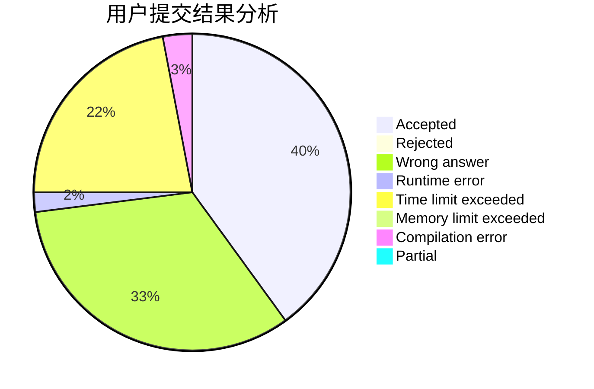
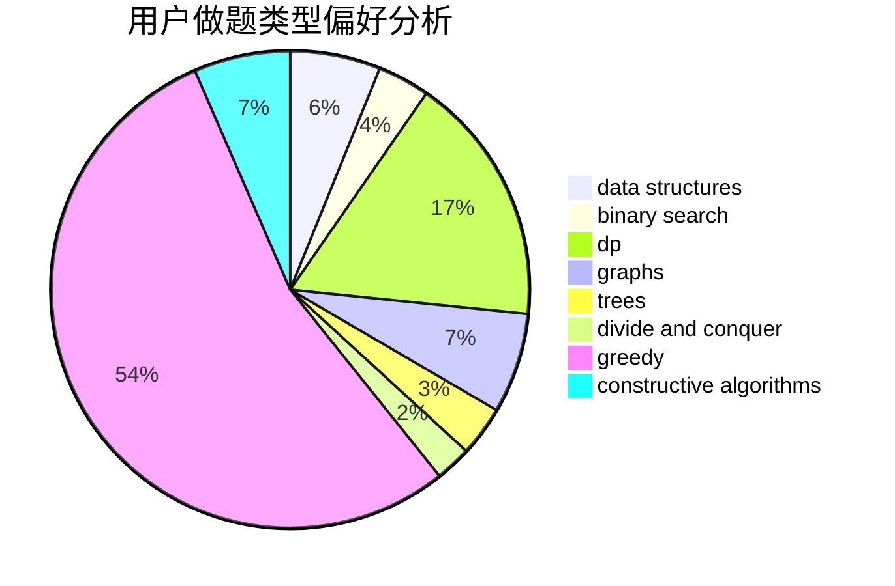
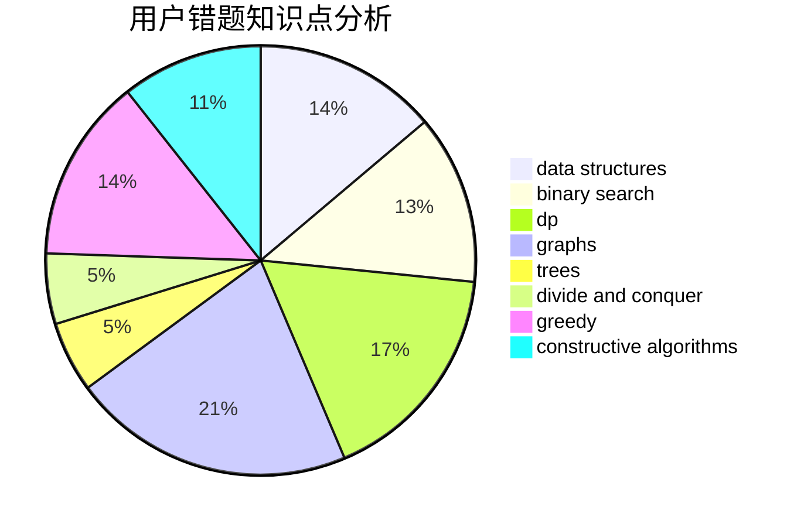

# get_r_ight

<!-- tabs:start -->

#### **用户提交结果分析**

#### **用户做题类型偏好分析**

#### **用户错题知识点分析**

<!-- tabs:end -->
# 推荐题目
[1119H](https://codeforces.com/contest/1119/problem/H)		fft,
                        math		  
[702E](https://codeforces.com/contest/702/problem/E)		data structures,
                        graphs		  
[117D](https://codeforces.com/contest/117/problem/D)		divide and conquer,
                        math		  
[542F](https://codeforces.com/contest/542/problem/F)		dp,
                        greedy		  
[1380B](https://codeforces.com/contest/1380/problem/B)		greedy		  
[924C](https://codeforces.com/contest/924/problem/C)		data structures,
                        dp,
                        greedy		  
[1467D](https://codeforces.com/contest/1467/problem/D)		combinatorics,
                        dp,
                        math		  
[653F](https://codeforces.com/contest/653/problem/F)		data structures,
                        string suffix structures,
                        strings		  
[841D](https://codeforces.com/contest/841/problem/D)		dsu,graphs,sortings,trees		  
[1280A](https://codeforces.com/contest/1280/problem/A)		implementation,
                        math		  
