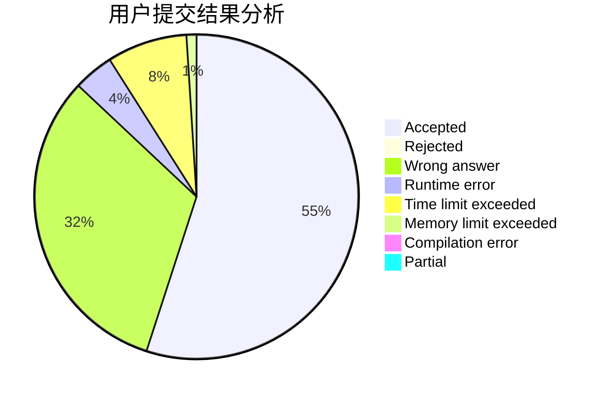
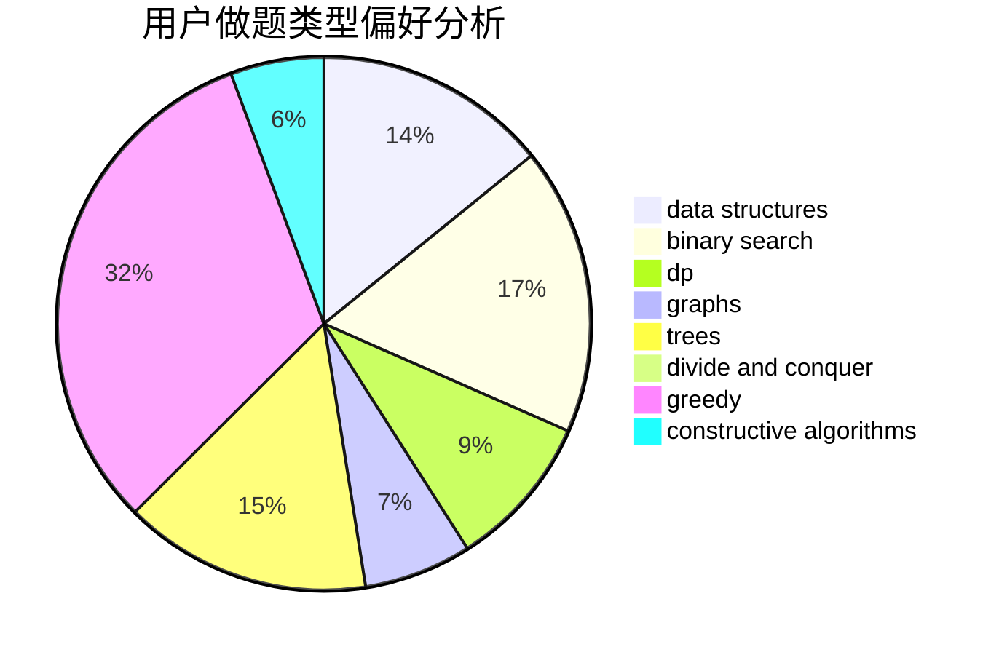
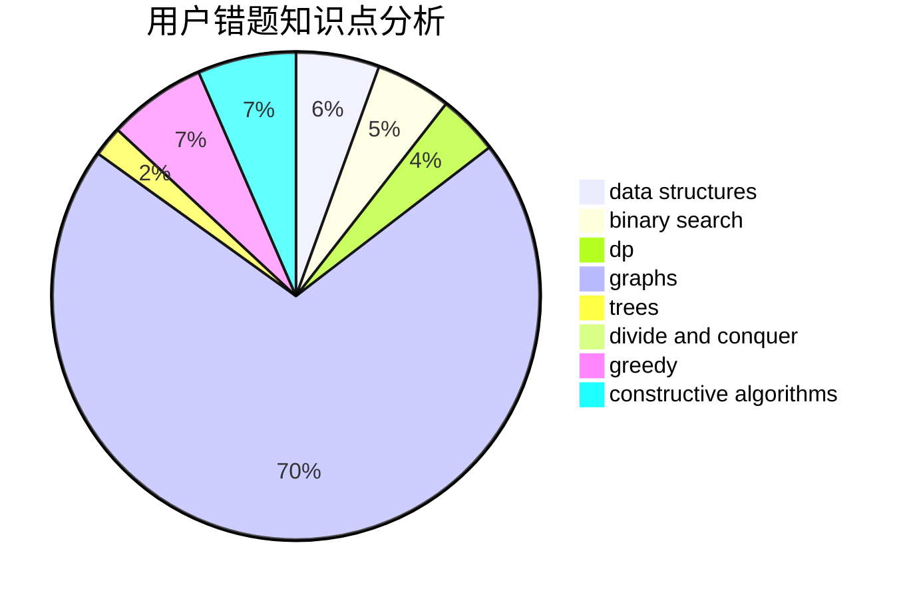

# gggggxz

<!-- tabs:start -->

#### **用户提交结果分析**

#### **用户做题类型偏好分析**

#### **用户错题知识点分析**

<!-- tabs:end -->
# 推荐题目
[1338A](https://codeforces.com/contest/1338/problem/A)		greedy,
                        math		  
[778C](https://codeforces.com/contest/778/problem/C)		brute force,
                        dfs and similar,
                        dsu,
                        hashing,
                        strings,
                        trees		  
[1151B](https://codeforces.com/contest/1151/problem/B)		bitmasks,
                        brute force,
                        constructive algorithms,
                        dp		  
[349B](https://codeforces.com/contest/349/problem/B)		data structures,
                        dp,
                        greedy,
                        implementation		  
[846E](https://codeforces.com/contest/846/problem/E)		dfs and similar,
                        greedy,
                        trees		  
[223C](https://codeforces.com/contest/223/problem/C)		combinatorics,
                        math,
                        number theory		  
[1163B2](https://codeforces.com/contest/1163B/problem/2)		data structures,
                        implementation		  
[39J](https://codeforces.com/contest/39/problem/J)		hashing,
                        implementation,
                        strings		  
[389A](https://codeforces.com/contest/389/problem/A)		greedy,
                        math		  
[1234F](https://codeforces.com/contest/1234/problem/F)		bitmasks,
                        dp		  
