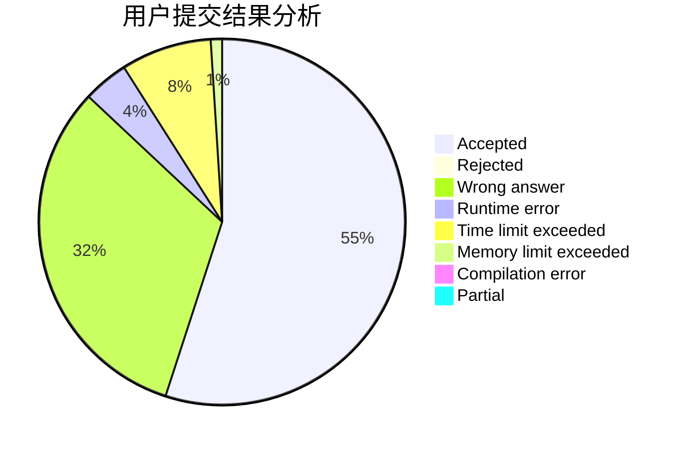
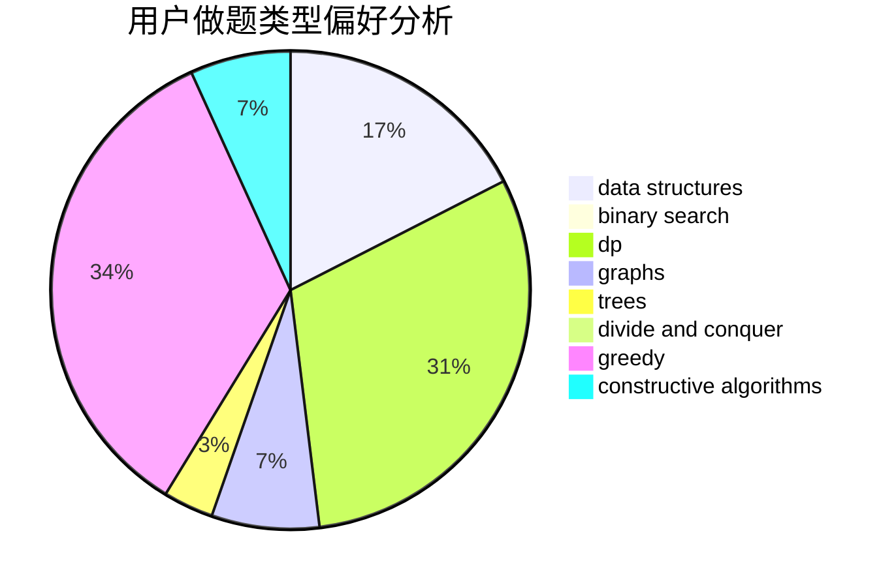
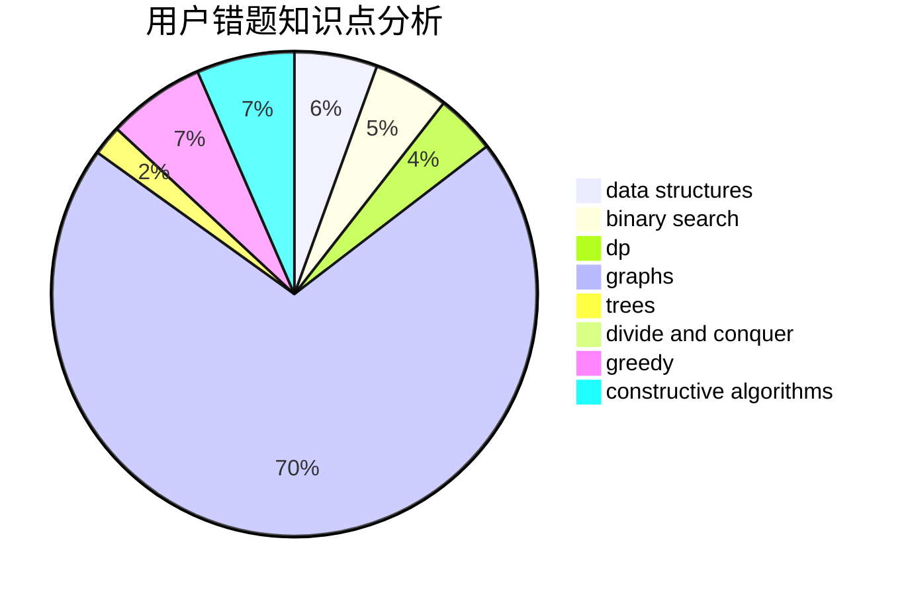

# gggggxz

<!-- tabs:start -->

#### **用户提交结果分析**

#### **用户做题类型偏好分析**

#### **用户错题知识点分析**

<!-- tabs:end -->
# 推荐题目
[1345B](https://codeforces.com/contest/1345/problem/B)		binary search,
                        brute force,
                        dp,
                        math		  
[796D](https://codeforces.com/contest/796/problem/D)		constructive algorithms,
                        dfs and similar,
                        dp,
                        graphs,
                        shortest paths,
                        trees		  
[1153B](https://codeforces.com/contest/1153/problem/B)		constructive algorithms,
                        greedy		  
[376A](https://codeforces.com/contest/376/problem/A)		implementation,
                        math		  
[864F](https://codeforces.com/contest/864/problem/F)		dfs and similar,
                        graphs,
                        trees		  
[241E](https://codeforces.com/contest/241/problem/E)		graphs,
                        shortest paths		  
[1164Q](https://codeforces.com/contest/1164/problem/Q)		dsu,graphs,sortings,trees		  
[429A](https://codeforces.com/contest/429/problem/A)		dfs and similar,
                        trees		  
[418C](https://codeforces.com/contest/418/problem/C)		dsu,graphs,sortings,trees		  
[1240C](https://codeforces.com/contest/1240/problem/C)		dsu,graphs,sortings,trees		  
