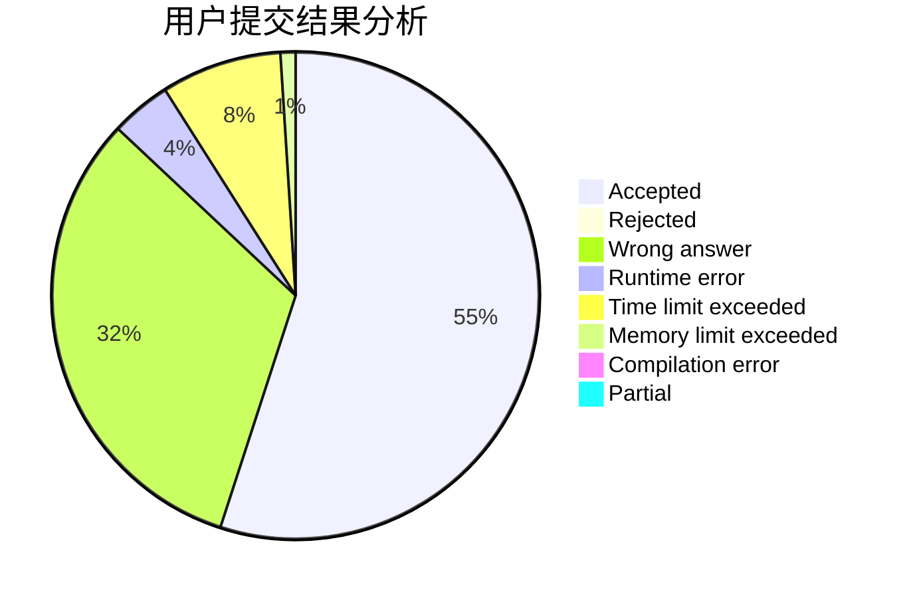
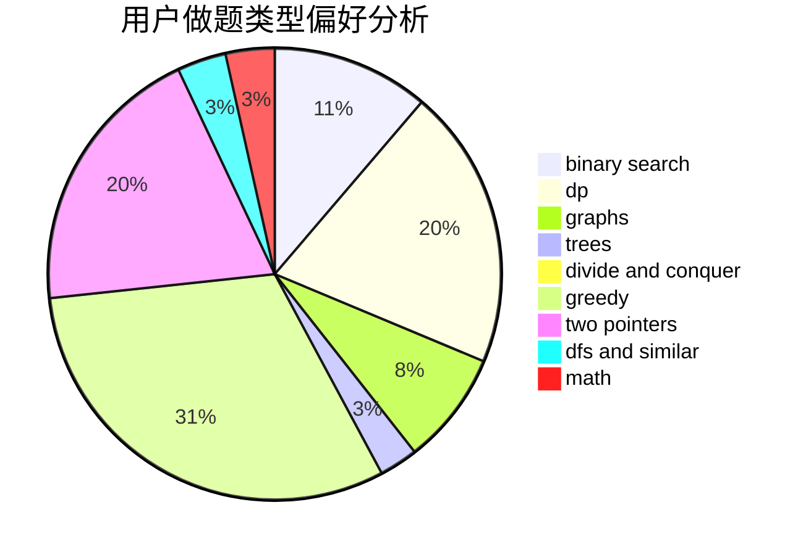

# gggggxz

<!-- tabs:start -->

#### **用户提交结果分析**

#### **用户做题类型偏好分析**

<!-- tabs:end -->
# 推荐题目
[1345B](https://codeforces.com/contest/1345/problem/B)
[796D](https://codeforces.com/contest/796/problem/D)
[1153B](https://codeforces.com/contest/1153/problem/B)
[376A](https://codeforces.com/contest/376/problem/A)
[864F](https://codeforces.com/contest/864/problem/F)
[241E](https://codeforces.com/contest/241/problem/E)
[1164Q](https://codeforces.com/contest/1164/problem/Q)
[429A](https://codeforces.com/contest/429/problem/A)
[418C](https://codeforces.com/contest/418/problem/C)
[1240C](https://codeforces.com/contest/1240/problem/C)
