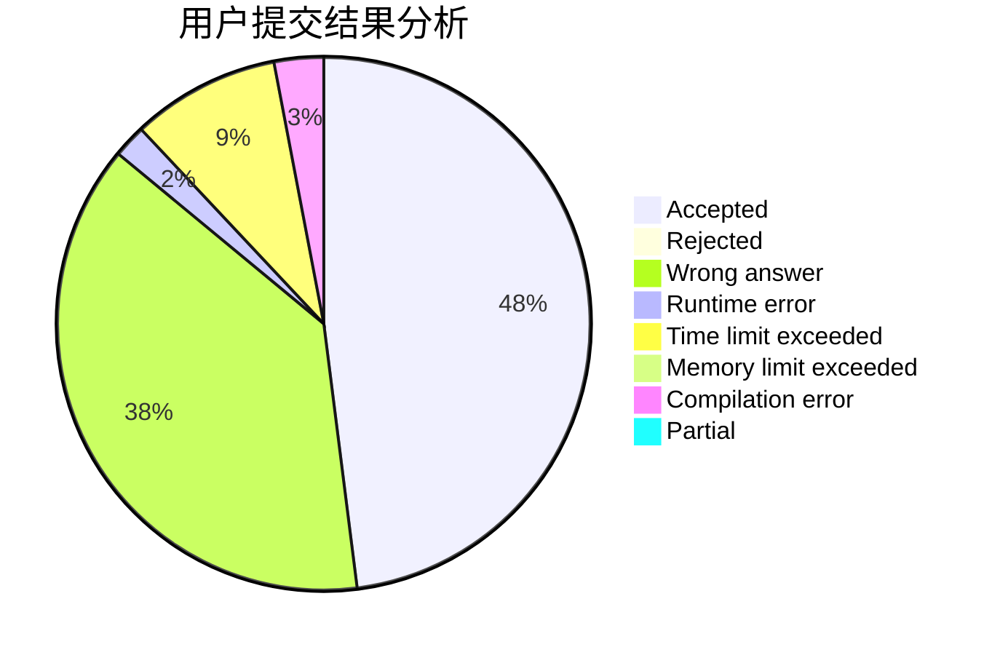
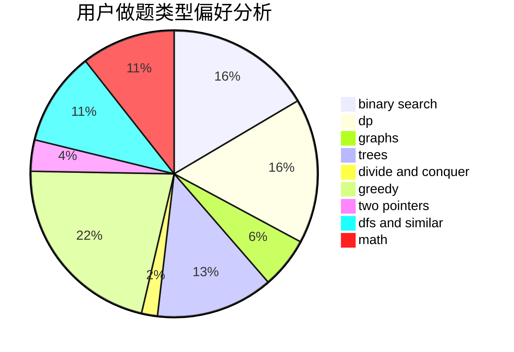

# ghj1222

<!-- tabs:start -->

#### **用户提交结果分析**

#### **用户做题类型偏好分析**

<!-- tabs:end -->
# 推荐题目
[1424G](https://codeforces.com/contest/1424/problem/G)
[682D](https://codeforces.com/contest/682/problem/D)
[1423C](https://codeforces.com/contest/1423/problem/C)
[952D](https://codeforces.com/contest/952/problem/D)
[20A](https://codeforces.com/contest/20/problem/A)
[1407E](https://codeforces.com/contest/1407/problem/E)
[914H](https://codeforces.com/contest/914/problem/H)
[1254E](https://codeforces.com/contest/1254/problem/E)
[1310D](https://codeforces.com/contest/1310/problem/D)
[870B](https://codeforces.com/contest/870/problem/B)
