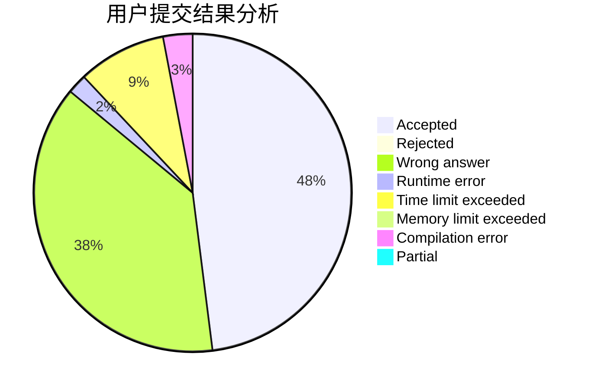
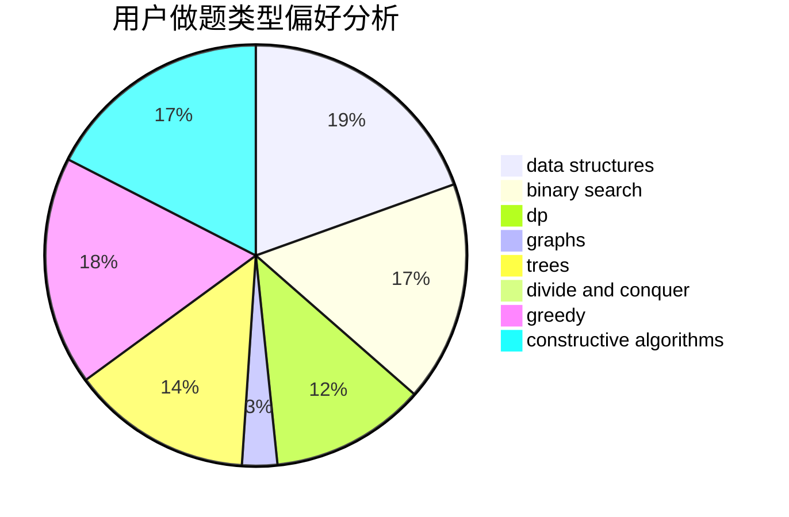
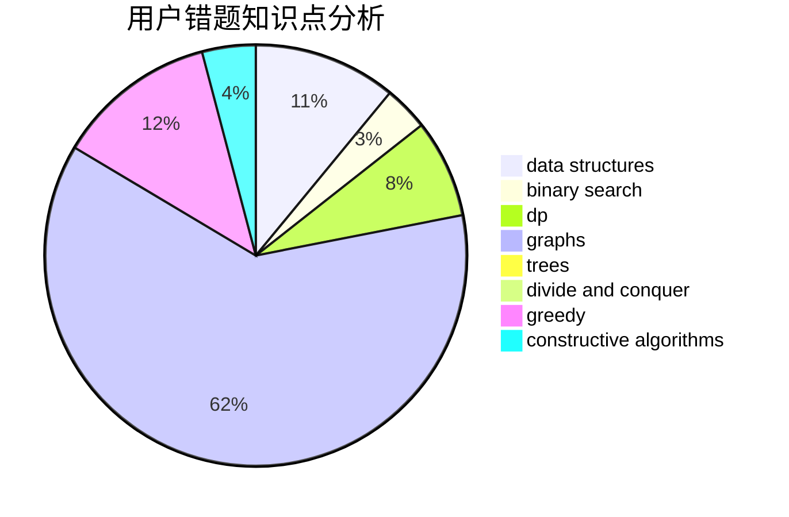

# ghj1222

<!-- tabs:start -->

#### **用户提交结果分析**

#### **用户做题类型偏好分析**

#### **用户错题知识点分析**

<!-- tabs:end -->
# 推荐题目
[1424G](https://codeforces.com/contest/1424/problem/G)		data structures,
                        sortings		  
[682D](https://codeforces.com/contest/682/problem/D)		dp,
                        strings		  
[1423C](https://codeforces.com/contest/1423/problem/C)		divide and conquer,
                        graphs,
                        trees		  
[952D](https://codeforces.com/contest/952/problem/D)		probabilities		  
[20A](https://codeforces.com/contest/20/problem/A)		implementation		  
[1407E](https://codeforces.com/contest/1407/problem/E)		constructive algorithms,
                        dfs and similar,
                        dp,
                        graphs,
                        greedy,
                        shortest paths		  
[914H](https://codeforces.com/contest/914/problem/H)		combinatorics,
                        dp,
                        games,
                        trees		  
[1254E](https://codeforces.com/contest/1254/problem/E)		combinatorics,
                        dfs and similar,
                        dsu,
                        trees		  
[1310D](https://codeforces.com/contest/1310/problem/D)		dp,
                        graphs,
                        probabilities		  
[870B](https://codeforces.com/contest/870/problem/B)		greedy		  
