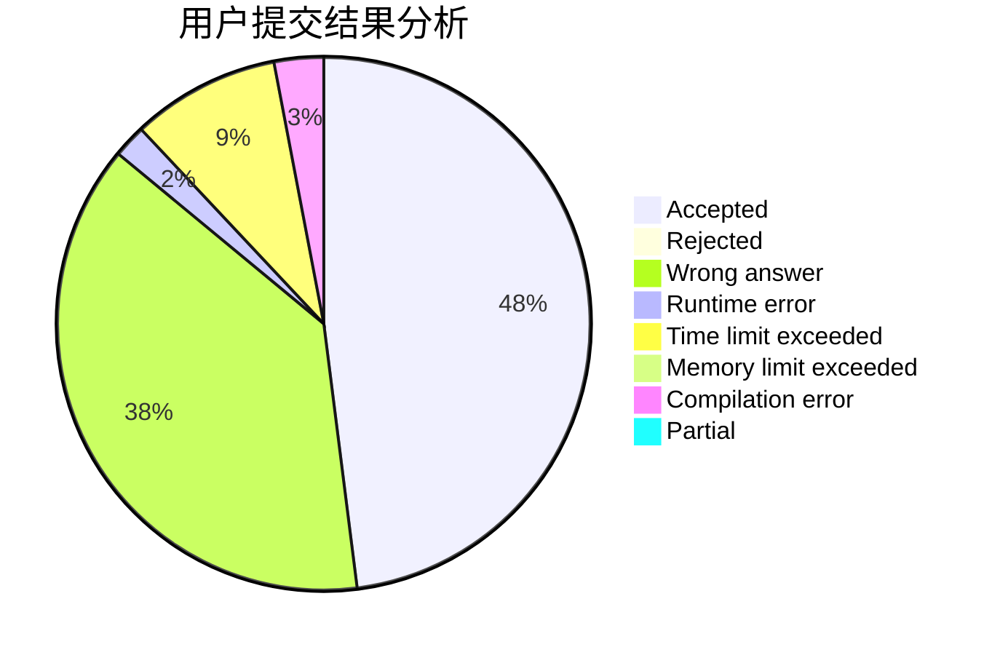
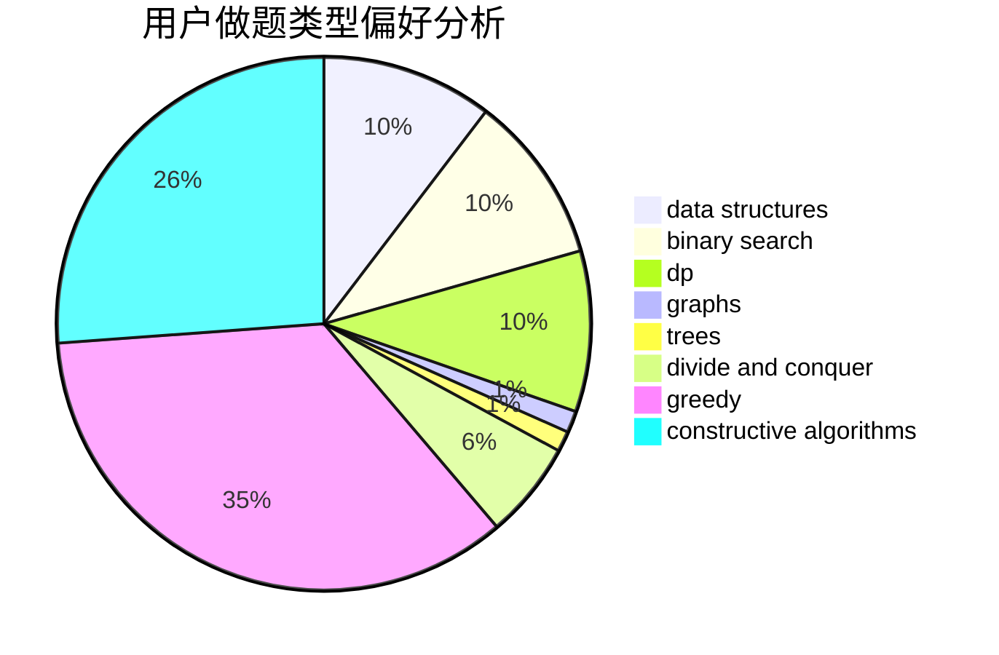
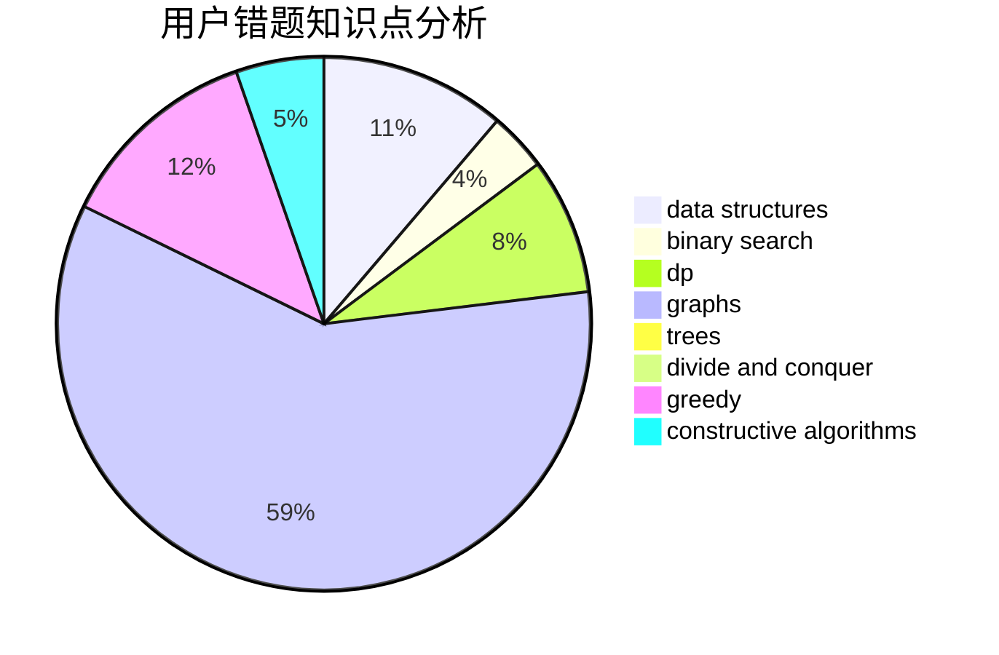

# ghj1222

<!-- tabs:start -->

#### **用户提交结果分析**

#### **用户做题类型偏好分析**

#### **用户错题知识点分析**

<!-- tabs:end -->
# 推荐题目
[1416F](https://codeforces.com/contest/1416/problem/F)		flows,
                        graph matchings,
                        greedy,
                        implementation		  
[662D](https://codeforces.com/contest/662/problem/D)		constructive algorithms,
                        greedy,
                        implementation,
                        math		  
[1413F](https://codeforces.com/contest/1413/problem/F)		data structures,
                        trees		  
[931D](https://codeforces.com/contest/931/problem/D)		dsu,graphs,sortings,trees		  
[183D](https://codeforces.com/contest/183/problem/D)		dp,
                        greedy,
                        probabilities		  
[1398F](https://codeforces.com/contest/1398/problem/F)		binary search,
                        data structures,
                        dp,
                        greedy,
                        two pointers		  
[898F](https://codeforces.com/contest/898/problem/F)		brute force,
                        hashing,
                        math		  
[1250F](https://codeforces.com/contest/1250/problem/F)		brute force,
                        implementation		  
[1301A](https://codeforces.com/contest/1301/problem/A)		implementation,
                        strings		  
[852A](https://codeforces.com/contest/852/problem/A)		brute force,
                        implementation,
                        math		  
