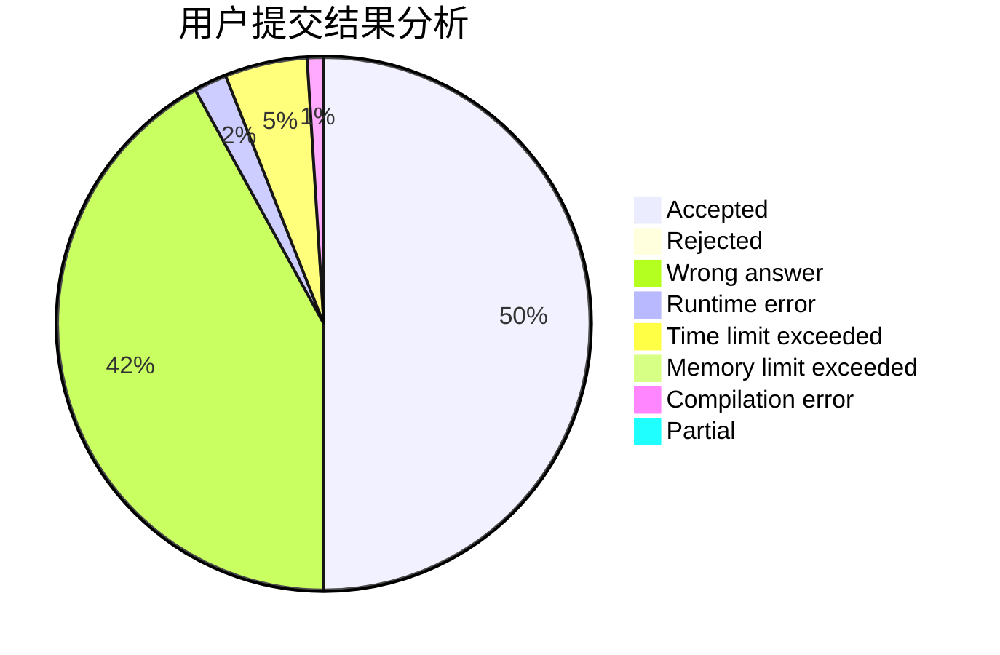
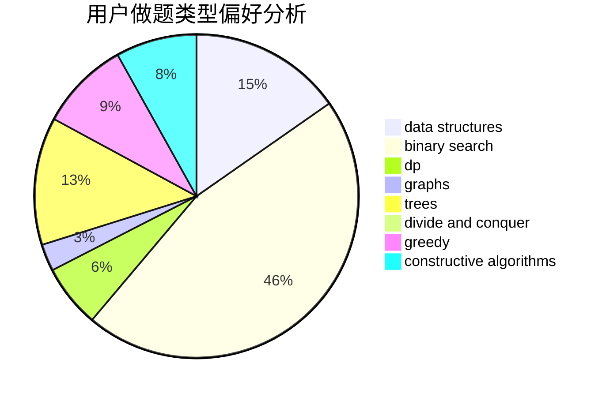
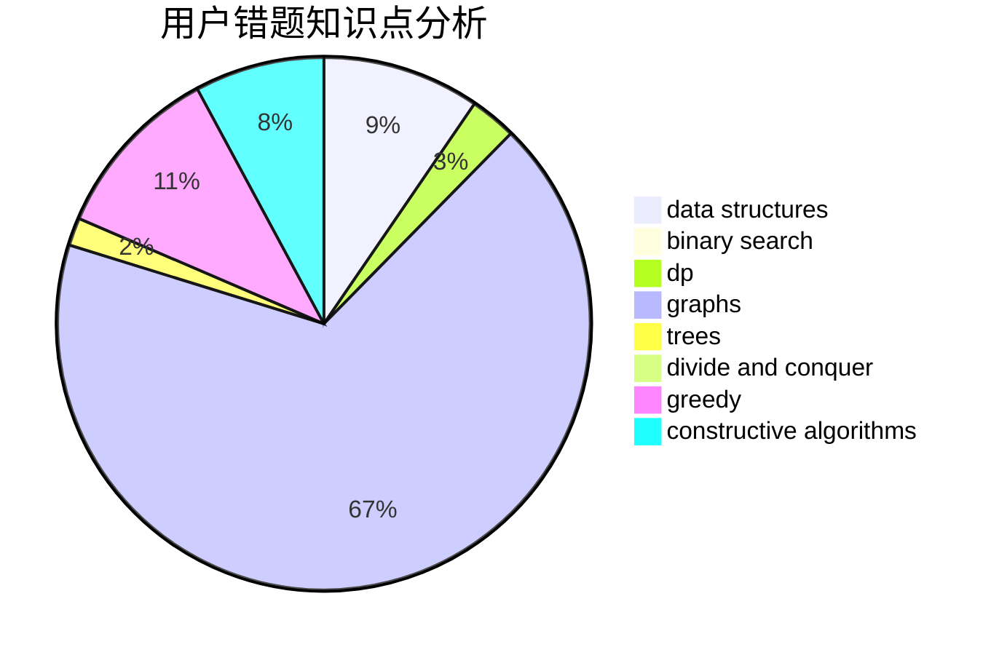

# gisp_zjz

<!-- tabs:start -->

#### **用户提交结果分析**

#### **用户做题类型偏好分析**

#### **用户错题知识点分析**

<!-- tabs:end -->
# 推荐题目
[27D](https://codeforces.com/contest/27/problem/D)		2-sat,
                        dfs and similar,
                        dsu,
                        graphs		  
[463C](https://codeforces.com/contest/463/problem/C)		greedy,
                        hashing,
                        implementation		  
[835C](https://codeforces.com/contest/835/problem/C)		dp,
                        implementation		  
[370A](https://codeforces.com/contest/370/problem/A)		graphs,
                        math,
                        shortest paths		  
[1298D](https://codeforces.com/contest/1298/problem/D)		dsu,graphs,sortings,trees		  
[429A](https://codeforces.com/contest/429/problem/A)		dfs and similar,
                        trees		  
[680B](https://codeforces.com/contest/680/problem/B)		constructive algorithms,
                        implementation		  
[1172A](https://codeforces.com/contest/1172/problem/A)		greedy,
                        implementation		  
[164C](https://codeforces.com/contest/164/problem/C)		flows,
                        graphs		  
[388E](https://codeforces.com/contest/388/problem/E)		geometry		  
